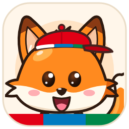

# Minditful · Milo (WPF, Windows)




Ứng dụng desktop hiện thực hoá prototype **"Milo sống"** và tài liệu [Kịch bản hành vi Milo](docs/Kịch%20bản%20hành%20vi%20Milo.md).
Milo là chú cáo ẩn ở góc phải dưới màn hình (chỉ chừa chóp đuôi). Milo chỉ ló ra vào đúng lúc: không chen vào cuộc họp, và tối đa 1 lời nhắc chủ động mỗi 15 phút.

Cả **3 môi trường đều là cùng một app**: Milo sống trên desktop Windows (overlay trong suốt ở góc màn hình, ngay trên taskbar), có biểu tượng ở khay hệ thống, dashboard, thẻ nhắc… Một bộ não duy nhất (Rule Engine → Điều phối → Mood Engine) chạy bên dưới. Ba môi trường chỉ khác **nguồn thời gian, dữ liệu và tín hiệu**:

| Môi trường | Dữ liệu | Milo hiện ở đâu | Dùng để |
| --- | --- | --- | --- |
| **Demo** | Ngày mẫu Thứ Năm 24/9 của prototype: giờ, lịch, email, task và thao tác người dùng theo kịch bản | **Desktop thật** (overlay trong suốt ở góc màn hình) + khay hệ thống + bảng điều khiển kịch bản | Chạy đủ 17 tình huống của prototype + 5 tình huống mở rộng trên app thật: tua 60×/120×/300×, nhảy 17 mốc, kịch bản trình diễn 28 bước tự chạy, bật từng case, "Giả vờ bạn đang…" để bẻ kịch bản. Tủ đồ mở full |
| **Sandbox** | Tenant thử `mindiful.onmicrosoft.com` (Teams, Outlook) + Azure DevOps `mindiful-sandbox` — API thật | Desktop thật (overlay trong suốt) + khay hệ thống + Bảng điều khiển có công cụ test | Thử tích hợp thật mà không đụng tenant Bosch. 2 chế độ: *test* (ép Milo làm, ngưỡng rút gọn) và *như Production*. Đọc email ~20 giây, lịch và task ~30 giây để demo realtime. Có công tắc hiện Milo khi chia sẻ màn hình |
| **Production** | Tenant Bosch: Teams presence, Outlook, Azure Boards | Desktop thật, ẩn khỏi share màn hình | Dùng hằng ngày |

**Milo làm được gì (tóm tắt):**
- **Nhắc đúng lúc, im lặng đúng lúc:** chào sáng, sắp họp (kèm gợi ý theo loại cuộc họp đoán từ tiêu đề/agenda ngay trên máy), họp liên tục, làm liền, nghỉ quá ít, chưa nghỉ trưa, nhảy việc, quá giờ, tan tầm; im lặng khi họp, trình chiếu, toàn màn hình, tập trung (lúc tập trung Milo ngủ trên chóp đuôi).
- **Làm giúp:** giữ chỗ nghỉ trong lịch, khoá giờ tập trung + bật Không làm phiền Teams, tìm khoảng trống dài nhất để tập trung, mở slide, mở email chờ, báo task kẹt.
- **Có mới (realtime):** email mới gửi thẳng cho bạn, lời mời họp mới, task mới được giao → Milo báo ngay.
- **Trò chuyện với Milo:** chat tự do (AI hoặc theo từ khoá); Milo đề nghị nút tính năng hợp với câu bạn gõ.
- **Điểm mood có cơ sở khoa học** (JD-R, nghiên cứu từ 2021), dashboard trái cây, bảng chi tiết hôm nay / tuần, báo cáo tuần sáng thứ Hai, kiểm chứng WHO-5.
- **Cá tính:** tính cách Dễ thương / Hài hước / Pha trộn (9 động tác lấy cảm hứng meme), tủ đồ 14 món phối 5 ô mở khoá bằng thói quen tốt, đồng phục Bosch.
- **Tiện dụng:** chuột phải Milo để thay đồ / trò chuyện / đổi tính cách, kéo chóp đuôi đổi góc, khởi động cùng Windows, nhiều key AI xoay vòng.
- **Riêng tư:** AI chỉ nhận con số và nhãn, không bao giờ nhận tiêu đề, agenda hay nội dung; dữ liệu cá nhân chỉ trên máy và tự xoá theo tuần.

**Điểm mood lấy từ đâu?** Mô hình Job Demands–Resources, mỗi khoản dựa trên nghiên cứu công bố từ 2021 tới nay, có bộ test chứng minh công thức đúng chiều nghiên cứu với 20.000 bộ số liệu ngẫu nhiên, và trang *Kiểm chứng điểm* (WHO-5) để đo với người thật: **[docs/CO-SO-KHOA-HOC.md](docs/CO-SO-KHOA-HOC.md)**.

**Đi present?** Flow ngày present (Demo ~13 phút → Sandbox realtime ~9 phút) và checklist chuẩn bị: **[KICH-BAN-DEMO.md mục 0](docs/KICH-BAN-DEMO.md)**. Kịch bản từng bước: **[Demo](docs/KICH-BAN-DEMO.md)** (28 bước, đủ mọi tình huống, động tác, tủ đồ) · **[Sandbox realtime](docs/KICH-BAN-SANDBOX.md)** (gửi mail / mời họp / giao task thật, Milo báo trong ~20 giây).

**Mới dùng app?** Đọc **[Hướng dẫn sử dụng](docs/HUONG-DAN-SU-DUNG.md)**: Milo trên màn hình, bảng điều khiển từng trang, từng tính năng, cách dùng ở 3 môi trường, vì sao Milo không hiện. README này dành cho cài đặt, cấu hình và test.

## Cài đặt từ đầu

Làm theo thứ tự dưới đây trên **máy Windows 10 (1809+) hoặc Windows 11**. App là WPF nên chỉ **chạy** được trên Windows. macOS/Linux build được và chạy được `dotnet test`, nhưng không mở được app.

### Bước 1. Cài công cụ

| Công cụ | Bắt buộc? | Cài | Kiểm tra |
| --- | --- | --- | --- |
| **Git** | Có | [git-scm.com/download/win](https://git-scm.com/download/win) hoặc `winget install Git.Git` | `git --version` |
| **.NET 8 SDK** (x64) | Có | [dotnet.microsoft.com/download/dotnet/8.0](https://dotnet.microsoft.com/download/dotnet/8.0) hoặc `winget install Microsoft.DotNet.SDK.8` | `dotnet --list-sdks` có dòng `8.0.x` |
| Visual Studio 2022 (17.8+), workload **.NET desktop development** | Không (tiện để debug) | [visualstudio.microsoft.com](https://visualstudio.microsoft.com/) | Mở được `Minditful.sln` |
| VS Code + extension **C# Dev Kit** | Không (thay cho VS) | [code.visualstudio.com](https://code.visualstudio.com/) | — |
| Microsoft Teams (desktop hoặc web) | Chỉ Sandbox/Prod | — | Cần đang mở thì mới có presence và DND |

Cài xong .NET SDK, **mở lại** cửa sổ PowerShell/Terminal để nhận lệnh `dotnet`.

### Bước 2. Lấy code và build

```powershell
git clone https://github.com/Killig3110/mindiful.git
cd mindiful
dotnet restore          # tải package NuGet (lần đầu ~1–2 phút)
dotnet build            # phải ra: Build succeeded · 0 Warning(s) · 0 Error(s)
dotnet test             # phải ra: Passed! - Failed: 0, Passed: 265
```

Cấu trúc thư mục sau khi clone:

```
mindiful/
├─ .env.sample            ← mẫu biến môi trường (được commit)
├─ Minditful.sln
├─ docs/                  ← HUONG-DAN-SU-DUNG, KICH-BAN-DEMO, KICH-BAN-SANDBOX, KET-NOI-SANDBOX, KIEN-TRUC, CO-SO-KHOA-HOC, Kịch bản hành vi Milo
├─ src/Minditful.Core/    ← bộ não (không phụ thuộc Windows)
├─ src/Minditful.Integrations/  ← Graph, Azure DevOps, AI (Claude / tương thích OpenAI), SQLite
├─ src/Minditful.App/     ← app WPF + appsettings.json
└─ tests/Minditful.Core.Tests/
```

### Bước 3. Tạo file `.env`

```powershell
Copy-Item .env.sample .env      # PowerShell  (cmd: copy .env.sample .env)
notepad .env                    # hoặc mở bằng VS Code
```

- `.env` nằm ở **gốc repo**, cạnh `.env.sample`. Git đã bỏ qua file này (`.gitignore`), nên **không bao giờ commit** nó.
- App tự tìm `.env` khi chạy bằng `dotnet run` từ repo.
- Nếu chạy file exe đã đóng gói: đặt `.env` cạnh `Minditful.exe`, hoặc ở `%LOCALAPPDATA%\Minditful\.env`.
- Dòng để trống = dùng giá trị mặc định trong `src/Minditful.App/appsettings.json`. Vì vậy chỉ cần điền những dòng liên quan tới môi trường bạn dùng.

**Cần điền gì cho từng môi trường:**

| Môi trường | Điền trong `.env` | Ghi chú |
| --- | --- | --- |
| **Demo** | *Không cần gì* | Chạy được ngay, không cần mạng |
| **Sandbox** | `MINDITFUL_SANDBOX_ADO_PAT=<PAT>` | TenantId, ClientId, org `mindiful-sandbox`, project, team **đã có sẵn** trong appsettings.json. PAT do **thulu@** tạo ở `https://dev.azure.com/mindiful-sandbox` → *User settings → Personal access tokens*, scope *Work Items (Read & write)* + *Project and Team (Read)*. Chi tiết: [docs/KET-NOI-SANDBOX.md](docs/KET-NOI-SANDBOX.md) |
| **Production** | `MINDITFUL__Minditful__Production__AzureDevOps__Organization=…`<br>`…__Project=…` · `…__Team=…`<br>`MINDITFUL_PROD_ADO_PAT=<PAT>` | TenantId/ClientId Bosch đã có trong appsettings.json; IT cần duyệt quyền (xem mục *Production* bên dưới) |
| Tuỳ chọn · AI | Groq / Ollama / Gemini…: `…Llm__Provider=OpenAI`, `…Llm__BaseUrl`, `…Llm__Model`, `LLM_API_KEY` (nhiều key ngăn bằng dấu phẩy). Claude: `ANTHROPIC_API_KEY=sk-ant-…`. Bật chấm mood bằng AI: `…Llm__Features__Mood=Hybrid` | Không có AI thì app dùng luật + câu mẫu, vẫn chạy đủ. Chọn dịch vụ: mục [Chọn AI để test](#chọn-ai-để-test-miễn-phí) |
| Tuỳ chọn · mở thẳng môi trường | `MINDITFUL_ENV=Scenario` / `Sandbox` / `Prod` | Để trống = hiện màn hình chọn |
| Tuỳ chọn · lưu trữ | `…Storage__RetentionPeriod=Week` hoặc `Month` | Mặc định tự xoá dữ liệu cá nhân theo tuần |
| Tuỳ chọn · tính năng chăm sóc | `…Wellbeing__MicroBreakEveryMinutes=0` để tắt nhắc nghỉ ngắn, `…Wellbeing__FocusPlan=false`… | Mặc định bật hết. Xem bảng đầy đủ ở [Tham chiếu biến `.env`](#tham-chiếu-biến-env) |

Ví dụ `.env` tối thiểu để chạy Sandbox:

```ini
MINDITFUL_SANDBOX_ADO_PAT=xxxxxxxxxxxxxxxxxxxxxxxxxxxxxxxxxxxxxxxxxxxxxxxxxxxx
```

PAT và API key cũng có thể dán vào ô **Lưu PAT / Lưu key** trong Bảng điều khiển khi app đang chạy. Khi đó chúng được lưu mã hoá DPAPI trên máy, không cần ghi vào `.env`.

### Bước 4. Chạy

**Dòng lệnh** (từ thư mục gốc repo):

```powershell
dotnet run --project src/Minditful.App                       # màn hình chọn môi trường
dotnet run --project src/Minditful.App -- --env Scenario     # Demo
dotnet run --project src/Minditful.App -- --env Sandbox
dotnet run --project src/Minditful.App -- --env Prod
```

**Visual Studio:** mở `Minditful.sln` → chọn startup project **Minditful.App** → chọn launch profile ở thanh công cụ: `Scenario (Demo)`, `Sandbox`, `Prod`, hoặc `Chọn môi trường` → F5.

**File exe để gửi người khác** (không cần cài .NET):

```powershell
dotnet publish src/Minditful.App -c Release -r win-x64 --self-contained -p:PublishSingleFile=true -p:IncludeNativeLibrariesForSelfExtract=true -p:DebugType=none -o dist/Minditful-win-x64
# kết quả: dist/Minditful-win-x64/Minditful.exe (+ appsettings.json). Thư mục dist/ đã nằm trong .gitignore
```

Gửi kèm `appsettings.json`. Người nhận tự tạo `.env` của họ cạnh file exe; **không gửi `.env` của bạn**, vì trong đó có PAT/API key.

**Lần đầu chạy Sandbox/Prod:**
- Trình duyệt mở trang đăng nhập Microsoft. Chọn đúng tài khoản: Sandbox là **thulu@mindiful.onmicrosoft.com**, Prod là tài khoản Bosch.
- Bảng điều khiển phải hiện *Đã đăng nhập …* và Azure Boards *N work item đang làm*.
- Những lần sau app đăng nhập im lặng, không hỏi lại.

Khi chạy, Milo ở **góc phải dưới màn hình** và có biểu tượng chóp đuôi ở **khay hệ thống**; chuột phải vào biểu tượng để mở menu, *Thoát Milo* để tắt. Đổi môi trường lúc đang chạy: menu khay → **Chuyển môi trường**. Nếu lần trước đã tick "Nhớ lựa chọn", giữ **Shift** khi mở app để chọn lại môi trường.

### Bước 5. Cập nhật code mới

```powershell
git pull
dotnet build
dotnet test
```

`.env` và dữ liệu local (`%LOCALAPPDATA%\Minditful`) không bị ảnh hưởng. Khi `.env.sample` có dòng mới, chép những dòng đó sang `.env`.

### Lỗi hay gặp khi cài

| Hiện tượng | Nguyên nhân | Cách sửa |
| --- | --- | --- |
| `'dotnet' is not recognized` | Chưa cài SDK hoặc chưa mở lại terminal | Cài .NET 8 SDK, mở terminal mới |
| `NETSDK1045` / không tìm thấy SDK 8 | Chỉ có runtime, hoặc SDK cũ | Cài **SDK** 8.0 (không phải Runtime) |
| `dotnet restore` báo lỗi mạng / 407 trên mạng Bosch | Proxy công ty chặn nuget.org | Đặt `HTTPS_PROXY` hoặc cấu hình proxy trong `%APPDATA%\NuGet\NuGet.Config`, hoặc restore ngoài mạng công ty |
| App không mở trên macOS/Linux | WPF chỉ chạy trên Windows | Dùng máy Windows; trên Mac chỉ chạy được `dotnet build` và `dotnet test` |
| Chạy exe bị Windows SmartScreen chặn | Exe chưa ký số | *More info → Run anyway*; bản phát hành chính thức nên ký số |
| Sandbox báo "Chưa kết nối Azure Boards (chưa có PAT)" | `.env` thiếu PAT hoặc đặt sai chỗ | Kiểm tra `.env` ở gốc repo (hoặc cạnh exe), đúng tên `MINDITFUL_SANDBOX_ADO_PAT` |
| Đăng nhập báo lỗi AADSTS… | Cấu hình app registration | Bảng điều khiển ghi lý do bằng tiếng Việt; xem [KET-NOI-SANDBOX.md](docs/KET-NOI-SANDBOX.md) mục 8 |

## Hướng dẫn test 3 môi trường (dành cho người mới và khi present)

> Tài liệu kiến trúc chi tiết (flow, sequence, dữ liệu, API): **[docs/KIEN-TRUC.md](docs/KIEN-TRUC.md)**.
> Kết nối tenant sandbox: **[docs/KET-NOI-SANDBOX.md](docs/KET-NOI-SANDBOX.md)**. Hành vi gốc của Milo: **[docs/Kịch bản hành vi Milo.md](docs/Kịch%20bản%20hành%20vi%20Milo.md)**.

### 0. Chuẩn bị

Làm xong mục **[Cài đặt từ đầu](#cài-đặt-từ-đầu)** ở trên: `dotnet test` ra `Passed! … 265`, và `.env` đã điền cho môi trường cần test.

Đang chạy mà muốn đổi: menu khay → **Chuyển môi trường** (hoặc bảng điều khiển → *⇄ Chuyển môi trường*): app mở Milo ở môi trường mới với `--env` rồi tự đóng bản cũ, dữ liệu hôm nay được lưu trước. Mở thẳng một môi trường: `--env Scenario` (= Demo), `--env Sandbox`, `--env Prod`. Nếu đã tick "Nhớ lựa chọn", **giữ Shift** khi mở app để hiện lại màn hình chọn.

Cả 3 môi trường đều là **cùng một app**:
- Milo sống ở **góc phải dưới màn hình thật**, ngay trên taskbar.
- Khay hệ thống có biểu tượng **chóp đuôi cáo**; chuột phải vào để mở menu.
- Có một **bảng điều khiển** (tông kem như thẻ của Milo): thanh bên trái chọn trang, dải trên cùng luôn ghi "Milo đang làm gì" bằng lời thường. Demo có các trang *Bắt đầu · Kịch bản trình diễn · Ngày mẫu · Thử tình huống · Milo của bạn · Mood Engine · Bộ não Milo*; Sandbox/Prod có *Tổng quan · Kết nối · (Sandbox chế độ test: Thử tình huống) · Milo của bạn · Mood Engine · Kiểm chứng điểm · Bộ não Milo*. Dưới nhãn môi trường có nút **⇄ Chuyển môi trường**.
- Hướng dẫn dùng app cho người mới, từng tính năng: **[docs/HUONG-DAN-SU-DUNG.md](docs/HUONG-DAN-SU-DUNG.md)**.

### 1. Demo (Scenario): không cần tài khoản, không cần mạng

Dùng để present và để kiểm tra đủ 22 tình huống (17 của prototype + 5 mở rộng: Giữ giờ tập trung, Báo cáo tuần, Nghỉ ngắn, Trò chuyện, Có mới). Giờ, lịch, email, task và thao tác của người dùng đều theo **ngày mẫu Thứ Năm 24/9**.

**Cách nhanh nhất để xem đủ mọi case:** trang **Kịch bản trình diễn** → bật *Tự chạy qua các bước*. 28 bước (12 bước theo ngày mẫu, rồi các case còn lại, trò chuyện + nút tính năng, có mới (realtime), dashboard chi tiết, Milo ngủ khi tập trung, trình chiếu, mood realtime, 9 động tác hài, tủ đồ 6 bộ + đồng phục Bosch), có gợi ý câu nói từng bước. Chi tiết: [docs/KICH-BAN-DEMO.md](docs/KICH-BAN-DEMO.md).

**Mood realtime:** trang *Bắt đầu* (và *Kịch bản trình diễn*) có thẻ **Mood realtime**:
- Kéo *Căng thẳng giả lập* 0–60, hoặc bấm *Nghỉ cùng Milo (+3)* / *Xong 1 task (+2)*: điểm tính lại ngay.
- Bật *Gọi Milo ra đứng ở góc*: Milo đứng ngoài, dáng và màu đổi theo điểm tức thì (kiệt sức thì có chữ z).

**1a. Để ngày mẫu tự chạy** (trang *Bắt đầu*: bật công tắc "Người dùng mẫu tự bấm nút", tốc độ *Vừa 120×*):

| Giờ kịch bản | Nhìn vào góc màn hình | Nhìn vào bảng điều khiển |
| --- | --- | --- |
| 08:50 → 08:58 | Không có gì (máy "đang khoá") | Trạng thái *Nghỉ làm*, đồng hồ tua nhanh |
| 08:58 | Hai bàn chân bám mép → Milo leo lên → chữ **Hello!** → thẻ **Chào buổi sáng** (4 họp, 7 email, 6 task) → tự bấm *Đã rõ* → Milo leo xuống | Nhật ký: *Giao Chào sáng (P1, miễn ngân sách)* |
| 09:25 | Milo chỉ tay, thẻ **Teams · còn 5 phút · Sprint Planning**, vai *Trình bày* → *Mở slide* → *Tham gia* → Milo thụt nhanh | |
| 09:30–10:30 | Milo **im lặng**, cả chóp đuôi cũng ẩn; góc màn hình hiện chấm **"2 lời nhắc đang chờ"** | Cổng *Đang họp* sáng |
| 10:37 | Milo **nhảy vòng cung** từ mép phải (JumpIn) → thẻ **Task kẹt #4821** → *Khoá 90 phút* → Milo thụt xuống | Cổng *Giờ tập trung* sáng tới 12:07 |
| 12:07 | Bóng thoại "90 phút sâu xong rồi!" → thẻ **Nghỉ quá ít** → *Để sau* | |
| 12:55 | Thẻ **Lịch kín** + lịch mini → *Giữ chỗ* → khối xanh "Nghỉ 10'" trượt vào, dấu **Đã giữ** | |
| 13:10 | Thẻ **Email chờ** (3 email) → *Mở Outlook* | |
| 13:14–13:15 | Milo ló đầu thì thầm "Hôm nay mọng 80" → mở **dashboard trái cây** quanh Milo → *Tuần này →* → đóng | |
| 13:30–16:10 | Im lặng suốt 3 cuộc họp liền | Điểm tụt xuống 57 → **Mệt dần**, Milo nhạt màu |
| 16:12 | JumpIn → **Họp liên tục · 2h40** → *Đồng ý* → **vòng thở 4-4-4** × 3 → "Cảm ơn…" → leo xuống | |
| 17:45 | Milo nhảy tưng "Xong #4821 rồi!", điểm hồi lại | Mức về *Cân bằng* |
| 18:00 → 18:31 | Thẻ **Tan tầm** (tổng kết ngày) → *Thêm 30 phút* → 18:31 **Nhắc lại tan tầm** → *Về thôi* → Milo **chạy ra xe** | Điểm cuối ngày **54**, trạng thái *Nghỉ làm* |

**1b. Tự bấm:** tắt công tắc "Người dùng mẫu tự bấm nút", rồi bấm các nút trên thẻ của Milo ngay trên desktop. Nên thử:
- *Để sau* 2 lần: lần thứ 3 thẻ không còn nút Để sau.
- *Không cần*: chờ lâu hơn, bấm lần 2 thì giãn ×3.
- Gõ chat "mệt quá": Milo vào vòng thở. Gõ "đang bận": tương đương Để sau.

**1c. Chạy từng case:** trang **Thử tình huống** → *Cho Milo làm ngay*, bấm 1 thẻ là Milo giao ngay (22 thẻ, 4 nhóm: Chào hỏi, Giúp việc, Chăm sóc, Mới thêm). Checklist:

| Nhóm | Case | Cần thấy |
| --- | --- | --- |
| Xã giao | Chào sáng · Chào hỏi · Tan tầm · Nhắc lại tan tầm | Hello! + bản tin · thẻ 1 nút "Cảm ơn Milo" · tổng kết 3 ô · 1 nút "Về thôi" |
| Hỗ trợ | Sắp họp · Lịch kín · Email chờ · Task kẹt · Task xong · Hết giờ tập trung | Thẻ Teams · lịch mini · 3 email · thanh sprint · bóng thoại 3s · bóng thoại 3s |
| Chăm sóc | Họp liên tục · Quá giờ · Chưa nghỉ trưa · Làm liền · Nghỉ quá ít · Phân mảnh | Nhãn màu riêng từng case, nút Đồng ý / Để sau (Np) / Không cần, ô chat |
| Người dùng | Dashboard | 4 quả quanh Milo: nho (mood) · cam (cuộc họp, múi đã ăn = đã họp) · anh đào (email chờ) · táo cắn dở (sprint); rê chuột lên từng quả xem chi tiết. Bấm **Chi tiết** trên thanh tiêu đề: bảng nhỏ cỡ 1 thẻ ngay trên đầu Milo (dòng thời gian, Office Vibe, cuộc họp sắp tới; trang Tuần có 7 quả nho, thống kê, bạn trả lời Milo thế nào) |
| Mở rộng | Giữ giờ tập trung · Báo cáo tuần · Nghỉ ngắn · Trò chuyện · Có mới | Thẻ "khoảng trống dài nhất 16:15–17:45" → *Giữ 1h30* · thẻ "Tuần trước của bạn" + 1 mẹo → *Xem chùm nho* mở dashboard tuần · bóng thoại 5 giây, không nút · khung chat + 3 câu gợi ý · bấm 3 lần: email → lời mời họp → task mới gộp 1 thẻ |

**1d. Bẻ kịch bản** (trang **Thử tình huống** → *Giả vờ bạn đang…*, bật/tắt công tắc):
- *Đang gõ phím*: lời nhắc bị hoãn; gõ liên tục 5' thì chỉ hiện nhãn gọn "Milo có lời nhắn".
- *Rời khỏi máy* / *Khoá máy*: Milo không nói với màn hình trống / nghỉ hẳn.
- *Mở app toàn màn hình* hoặc *Teams: Không làm phiền*: Milo im lặng và hiện chấm chờ; **bấm chấm chờ** thì thẻ bung ra ngay kể cả đang họp.
- Nút *Nhảy việc 12 lần/giờ*: case Phân mảnh.
- *Ngày căng thẳng*: trừ 30 điểm, Milo đổi dáng mệt, có chữ z bay.
- *Teams: đang trình chiếu*: Milo trốn hẳn, kể cả chóp đuôi và chấm chờ; bấm lại thì hiện lại.
- Ở thẻ **Tan tầm** (18:00): bấm *Vui / Bình thường / Mệt* để thấy điểm đổi (+3 / 0 / −6), bấm *Giữ 10' nghỉ lúc 15:30* cho chuỗi họp ngày mai.

**1d'. Cá tính Milo:**
- **Tủ đồ phối theo ô:** chuột phải Milo → *Thay đồ cho Milo* (hoặc trang **Milo của bạn**). Ngày mẫu mở full tủ đồ (14/14 món) để trình diễn.
- **Tính cách:** chuột phải Milo → *Tính cách Milo*. Trang **Milo của bạn** có 9 nút xem thử động tác hài.

**1e. Tương tác chung** (cả 3 môi trường):
- Rê chuột lên chóp đuôi **0,6 giây** thì Milo ló đầu; bấm vào đuôi thì mở dashboard; Esc để đóng.
- **Kéo chóp đuôi** sang góc khác thì Milo neo góc đó; góc trái lật ngang, góc trên thò xuống.
- Menu khay có: Mở dashboard · Trò chuyện với Milo · Thay đồ cho Milo · Mở bảng điều khiển · (Demo) Phát/tạm dừng · Làm lại ngày mẫu · (Sandbox) Chế độ test · Hiện Milo khi chia sẻ màn hình · (Sandbox/Prod) Khởi động cùng Windows · Đăng nhập · Làm mới · **Chuyển môi trường** · Thoát.
- Chuột phải Milo / chóp đuôi: Thay đồ · Trò chuyện · Mở dashboard · Tính cách Milo.

### 2. Sandbox: dữ liệu thật của tenant `mindiful.onmicrosoft.com`

Điều kiện: đã setup theo [docs/KET-NOI-SANDBOX.md](docs/KET-NOI-SANDBOX.md) mục 1, và đã điền `MINDITFUL_SANDBOX_ADO_PAT` trong `.env`.

1. `dotnet run --project src/Minditful.App -- --env Sandbox`. **Lần đầu** trình duyệt mở màn hình đăng nhập: chọn **thulu@mindiful.onmicrosoft.com**, rồi đồng ý quyền nếu được hỏi.
2. Trang **Tổng quan** của bảng điều khiển phải có 2 chấm xanh:
   - *Microsoft 365*: "Đã đăng nhập thulu@… · quyền: …", không có chữ "THIẾU".
   - *Azure Boards*: "N work item đang làm · Sprint 1 x/y".
   - Trang **Thử tình huống** → *Chuẩn bị* ghi "Ngưỡng đang dùng: task kẹt ≥ 0 ngày · làm liền 20' …".
3. Chạy **checklist** ở mục 7 của KET-NOI-SANDBOX.md. Trang **Thử tình huống** có sẵn công cụ:

| Muốn test | Dùng |
| --- | --- |
| Chào sáng lại (bước 1) | **Reset ngày (chào sáng lại)** |
| Sắp họp, Lịch kín (bước 2, 4) mà không cần đồng nghiệp | **Tạo dữ liệu mẫu**: Teams meeting sau 7' + chuỗi 3 cuộc sau 52' + 6 work item |
| Tan tầm ngay (bước 12) | **Giờ về = bây giờ + 2'** |
| Xoá PAT (bước 14) | **Xoá PAT**: dashboard phải có dòng "Chưa kết nối Azure Boards" |
| Một case bất kỳ ngay lập tức | *Cho Milo làm ngay* → bấm thẻ case (bỏ qua điều kiện và ngân sách) |
| Giả lập gõ phím / rời máy / toàn màn hình / DND / trình chiếu | *Giả vờ bạn đang…* (công tắc đè lên tín hiệu thật, tắt để trả lại) |

4. Kiểm tra hành động thật:
   - *Giữ chỗ*: Outlook của thulu@ có sự kiện "Nghỉ cùng Milo" (tentative, category **Milo**).
   - *Khoá 90 phút*: có sự kiện "Tập trung: #id" (busy), và Teams chuyển **Do not disturb** nếu Teams đang mở.
   - Share màn hình trong Teams: người xem **không thấy** Milo (trừ khi bật *Hiện Milo khi chia sẻ màn hình*).
5. Kiểm tra dữ liệu local: dashboard → *Tuần này →* → rê chuột lên **chùm nho** để xem **Thống kê tuần**. Trang **Milo của bạn** → *Riêng tư & dữ liệu* ghi chính sách xoá và có nút **Xoá toàn bộ dữ liệu thống kê ngay**.
6. (Có AI) cấu hình AI như mục [Chọn AI để test](#chọn-ai-để-test-miễn-phí), đặt `…Features__Mood=Hybrid` và `…Features__Meetings=Llm` (hoặc bật ở trang *Mood Engine*), mở lại app:
   - Trang *Mood Engine* ghi "Sẵn sàng: Groq · qwen/qwen3.8-27b (n/n key còn lượt)"; trang *Tổng quan* → thẻ AI chấm xanh.
   - Trang *Bộ não Milo* có nguồn điểm "luật X + AI ±Y" và câu nhận xét.
   - Nhật ký có dòng *… viết sẵn câu cho …*.
7. Realtime: từ 1 tài khoản khác gửi email / lời mời họp / giao task cho thulu@ → thẻ **Có mới** sau ~20–30 giây. Chi tiết từng case: [docs/KICH-BAN-SANDBOX.md](docs/KICH-BAN-SANDBOX.md) mục 4.

Dọn dẹp sau khi test: trong Outlook, xoá các sự kiện category **Milo**; bấm *Xoá toàn bộ dữ liệu thống kê ngay* nếu cần.

### 3. Production: tenant Bosch

1. Đảm bảo IT đã duyệt app registration (TenantId/ClientId đã có trong appsettings.json). Điền org/project Azure DevOps và `MINDITFUL_PROD_ADO_PAT` trong `.env`.
2. `--env Prod`: lần đầu đăng nhập bằng tài khoản Bosch. Prod mặc định chỉ có 3 quyền đọc, nên Bảng điều khiển (mở từ khay) có thể ghi *THIẾU: Calendars.ReadWrite, Mail.Read, Presence.ReadWrite*. **Đó là đúng**, app đang tự hạ cấp:
   - Nút *Giữ chỗ trong lịch* đổi thành **Nhắc tôi lúc đó**, không ghi vào lịch.
   - Không có thẻ Email chờ và thẻ *Có mới* cho email; bản tin sáng bỏ dòng email. Lời mời họp và task mới vẫn được báo.
   - Khoá tập trung chỉ nhắc bạn tự bật DND.
3. Kiểm tra:
   - Tham gia một cuộc gọi Teams: Milo và chóp đuôi ẩn trong vòng ≤ 30s, lời nhắc dồn thành chấm chờ.
   - Share màn hình: người xem không thấy Milo.
   - Khoá máy rồi mở lại: Milo tiếp tục đúng trạng thái.
4. Khởi động cùng Windows: menu khay → **Khởi động cùng Windows** (hoặc bảng điều khiển → *Milo của bạn*). Tắt mặc định. Bật thì Milo ghi `"<đường dẫn Minditful.exe>" --env Prod` vào `HKCU\...\CurrentVersion\Run` (không cần admin). Đăng xuất rồi đăng nhập lại để thử. Sandbox cũng có công tắc này; mỗi lần chỉ 1 môi trường tự chạy.
5. Prod dùng **ngưỡng chuẩn** của tài liệu: làm liền 120', task kẹt ≥ 3 ngày, 2 lời nhắc cách nhau ≥ 15'. Vì vậy trong 1 buổi sẽ thấy ít lời nhắc hơn Sandbox. Đó là thiết kế, không phải lỗi.

### 4. Kịch bản present (~22 phút: Demo → Sandbox realtime)

Flow đầy đủ, checklist tối hôm trước và 15 phút trước giờ: **[KICH-BAN-DEMO.md mục 0](docs/KICH-BAN-DEMO.md)**. Tóm tắt:

| Phút | Làm gì | Nói gì |
| --- | --- | --- |
| 0–1 | Mở app → màn hình chọn 3 môi trường → **Demo** | "Một app, 3 môi trường, một bộ não." |
| 1–14 | Trang **Kịch bản trình diễn**, bấm 12 bước: 1, 2→3, 4, 8, 9, 12, 21, 22, 24, 26, 27, 28 | Nhắc đúng lúc, im lặng khi họp, làm giúp thật, dashboard trái cây, chat + nút tính năng, có mới, ngủ khi tập trung, mood realtime, tính cách hài hước, tủ đồ + Bosch |
| 14–15 | Menu khay → **Chuyển môi trường → Sandbox** | "Giờ xem Milo chạy thật với Teams, Outlook, Azure Boards." |
| 15–24 | Người phụ gửi mail, mời họp, giao task; kéo task Closed; cuộc họp tạo sẵn → Sắp họp → Tham gia → Share → Rời → DND | Milo báo trong ~20 giây, im lặng khi họp, ẩn khỏi màn hình chia sẻ |
| 24–25 | Kết | "Lên tenant Bosch chỉ cần IT cấp quyền cho app, không đổi code." |

Mẹo:
- Để bảng điều khiển ở màn hình thứ hai, màn hình chính chỉ có Milo.
- Tối hôm trước chạy thử 1 lượt kịch bản Demo, đăng nhập sẵn Sandbox, nhờ người gửi 1 email có dấu "?" để hôm sau có email chờ.
- Chiếu qua Teams: Sandbox bật *Hiện Milo khi chia sẻ màn hình* (tắt lại ở bước chứng minh Milo ẩn khỏi màn hình chia sẻ).

### 5. Sự cố hay gặp khi test

| Hiện tượng | Cách xử lý |
| --- | --- |
| Không thấy Milo | Nhìn đúng góc đã neo (mặc định phải dưới); nếu trạng thái là *Nghỉ làm*/*Im lặng* thì đó là đúng. Demo: kiểm tra đồng hồ kịch bản đang chạy |
| Mở app vào thẳng một môi trường không mong muốn | Giữ Shift khi mở, hoặc xoá `MINDITFUL_ENV` trong `.env` |
| Đăng nhập báo lỗi | Bảng điều khiển ghi lý do bằng tiếng Việt; xem thêm bảng lỗi AADSTS ở KET-NOI-SANDBOX.md mục 8 |
| Azure Boards 0 task | PAT phải do đúng người được giao task tạo; project/team đúng tên |
| App lỗi | Xem `%LOCALAPPDATA%\Minditful\crash.log` |
| Gửi mail mà Milo không báo *Có mới* | Mail phải gửi **thẳng** cho bạn (ô To) từ **tài khoản khác** (tự gửi cho mình chỉ báo khi `IncludeSelfSentMail=true`). Thứ có sẵn lúc mở app không được báo. Chờ ~20 giây ở Sandbox (Production 5 phút) hoặc bấm *Làm mới ngay*. Đang họp / tập trung thì thẻ nằm ở chấm chờ |
| Người xem Teams không thấy Milo | Sandbox/Production mặc định ẩn Milo khỏi màn hình chia sẻ. Sandbox: bật *Hiện Milo khi chia sẻ màn hình* (bảng điều khiển → *Tổng quan*, hoặc menu khay). Chiếu bằng HDMI thì luôn thấy |
| AI không trả lời / báo hết lượt | Trang *Mood Engine* xem dòng trạng thái (vd. "3/5 key còn lượt"). Hết lượt thì Milo tự dùng luật và câu mẫu, không lỗi. Thêm key vào `LLM_API_KEY` (ngăn bằng dấu phẩy) |

## Cấu hình

Bí mật và giá trị riêng của từng người (ClientId, tenant, organization, PAT, API key AI) nằm trong file **`.env`** ở gốc repo:

```powershell
copy .env.sample .env    # rồi điền giá trị
```

- `.env` đã nằm trong `.gitignore`, **không commit**. `.env.sample` là bản mẫu được commit, liệt kê đủ các biến.
- App tìm `.env` ở cạnh file exe, rồi đi ngược lên các thư mục cha (khi chạy `dotnet run` từ repo), cuối cùng ở `%LOCALAPPDATA%\Minditful\.env`.
- Biến môi trường thật của máy luôn được ưu tiên hơn `.env`. Dòng để trống giá trị thì dùng mặc định trong appsettings.json.
- Cú pháp `MINDITFUL__Minditful__Sandbox__Graph__ClientId` tương ứng khoá `Minditful:Sandbox:Graph:ClientId` trong appsettings.json.

Danh sách đầy đủ từng biến, giá trị hợp lệ và khi nào nên đổi: xem mục [Tham chiếu biến `.env`](#tham-chiếu-biến-env) ngay bên dưới.

PAT và API key cũng có thể nhập trong Bảng điều khiển; khi đó chúng được lưu mã hoá DPAPI trên máy.

### Tham chiếu biến `.env`

**Cách viết:**
- Mỗi dòng `TÊN=giá trị`, không cần dấu nháy, không có khoảng trắng thừa. Dòng bắt đầu bằng `#` là chú thích.
- **Để trống sau dấu `=`** nghĩa là dùng mặc định trong `src/Minditful.App/appsettings.json` (cột *Mặc định* dưới đây).
- `true` / `false` viết thường. Giờ viết dạng `HH:mm` (vd. `08:30`). Số phút là số nguyên.
- Tên dài `MINDITFUL__Minditful__A__B` chính là khoá `Minditful:A:B` trong appsettings.json (mỗi `__` là một cấp).
- **Sửa xong phải thoát hẳn app** (chuột phải icon ở khay → *Thoát*) rồi mở lại. App chỉ đọc `.env` lúc khởi động.
- Biến môi trường đặt thật trong Windows luôn thắng giá trị trong `.env`.

Trong các bảng, `…` là viết tắt của `MINDITFUL__Minditful__`.

**Chung**

| Biến | Giá trị | Mặc định | Khi nào đổi |
| --- | --- | --- | --- |
| `MINDITFUL_ENV` | `Scenario` (= `Demo`) · `Sandbox` · `Prod` (= `Production`) | trống = hiện màn hình chọn | Muốn app mở thẳng 1 môi trường, không hỏi. `--env` trên dòng lệnh thắng biến này |

**Giờ làm (`WorkDay`)**

| Biến | Giá trị | Mặc định | Khi nào đổi |
| --- | --- | --- | --- |
| `…WorkDay__Mode` | `Flexible` · `Fixed` | `Flexible` | `Flexible` kiểu Bosch: giờ vào = lần mở máy đầu ngày. `Fixed` nếu bạn làm giờ cố định |
| `…WorkDay__FlexEarliestStart` | `HH:mm` | `08:00` | Mở máy sớm hơn giờ này vẫn tính là vào lúc này |
| `…WorkDay__FlexLatestStart` | `HH:mm` | `10:00` | Mở máy muộn hơn giờ này vẫn tính là vào lúc này |
| `…WorkDay__FlexHours` | số giờ | `9` | 8 tiếng làm + 1 tiếng nghỉ trưa. Giờ về = giờ vào + số này |
| `…WorkDay__Start` / `…End` | `HH:mm` | `09:00` / `18:00` | Chỉ dùng khi `Mode=Fixed` |
| `…WorkDay__AwayAfterMinutes` | phút | `5` | Rời máy (idle) bao lâu thì tính là 1 lần nghỉ |

**Dữ liệu cá nhân trên máy (`Storage`)**

| Biến | Giá trị | Mặc định | Khi nào đổi |
| --- | --- | --- | --- |
| `…Storage__RetentionPeriod` | `Week` · `Month` | `Week` | `Week`: sang thứ Hai tự xoá. `Month`: sang ngày 1 tự xoá |
| `…Storage__KeepPreviousPeriod` | `true` · `false` | `true` | `false` = chỉ giữ tuần/tháng hiện tại (chặt nhất). Khi đó chùm nho 7 ngày và "so với tuần trước" đầu tuần sẽ trống |
| `…Storage__MoodSampleMinutes` | phút | `15` | Nhịp lưu mẫu mood |

**Tính năng chăm sóc mở rộng (`Wellbeing`, chỉ Sandbox/Production)**

| Biến | Giá trị | Mặc định | Khi nào đổi |
| --- | --- | --- | --- |
| `…Wellbeing__FocusPlan` | `true` · `false` | `true` | Tắt nếu không muốn Milo đề nghị giữ giờ tập trung |
| `…Wellbeing__FocusPlanMinMinutes` | phút | `60` | Khoảng trống ngắn nhất để đề nghị. Hạ xuống `30` khi test cho nhanh |
| `…Wellbeing__WeekReport` | `true` · `false` | `true` | Báo cáo tuần sáng thứ Hai |
| `…Wellbeing__MicroBreakEveryMinutes` | phút · `0` = tắt | `50` | Nhắc nghỉ ngắn (uống nước, vươn vai). Để `0` nếu thấy phiền |
| `…Wellbeing__MicroBreakMaxPerDay` | số lần | `6` | Trần số lần nhắc nghỉ ngắn mỗi ngày |
| `…Wellbeing__EveningCheck` | `true` · `false` | `true` | Thẻ tan tầm hỏi "Hôm nay thấy sao?" và gợi ý nghỉ giữa chuỗi họp ngày mai |
| `…Wellbeing__HideWhenPresenting` | `true` · `false` | `true` | Milo trốn hẳn khi Teams báo đang trình chiếu |
| `…Wellbeing__Wardrobe` | `true` · `false` | `true` | Tủ đồ phối đồ (mở khoá khi về đúng giờ, nghỉ, tập trung, và theo mùa) |
| `…Wellbeing__Incoming` | `true` · `false` | `true` | Thẻ *Có mới*: email mới, lời mời họp mới, task mới được giao |
| `…Wellbeing__Personality` | `Mixed` · `Cute` · `Funny` | `Mixed` | Tính cách Milo: Pha trộn (phần lớn dễ thương, lâu lâu hài), Dễ thương (không meme), Hài hước (gặp dịp là diễn meme). Người dùng đổi bằng chuột phải Milo thì được nhớ, đè lên giá trị này |

**AI (`Llm`, tuỳ chọn)** — Claude, hoặc mọi dịch vụ tương thích OpenAI (Groq, Ollama, Gemini, OpenRouter). Chọn dịch vụ: mục [Chọn AI để test](#chọn-ai-để-test-miễn-phí).

| Biến | Giá trị | Mặc định | Khi nào đổi |
| --- | --- | --- | --- |
| `…Llm__Provider` | trống (= Claude) · `OpenAI` | trống | `OpenAI` = dùng dịch vụ tương thích OpenAI (Groq, Ollama…) |
| `…Llm__BaseUrl` | URL | trống | Vd. `https://api.groq.com/openai/v1`, `http://localhost:11434/v1` (Ollama) |
| `LLM_API_KEY` | key, nhiều key ngăn bằng dấu phẩy | trống | Key của dịch vụ tương thích OpenAI (Ollama không cần). Nhiều key thì xoay vòng khi hết lượt |
| `ANTHROPIC_API_KEY` | `sk-ant-…` | trống | Chỉ khi dùng Claude. Hoặc dán ở ô *Lưu key* trong Bảng điều khiển |
| `…Llm__Enabled` | `true` · `false` | `true` | Công tắc tổng. `false` = chỉ luật + câu mẫu dù có key |
| `…Llm__Model` | tên model | `claude-opus-5` | Groq: `qwen/qwen3.8-27b` (khuyên dùng); Ollama: `qwen2.5:7b` |
| `…Llm__UseInDemo` | `true` · `false` | `false` | Bật để Demo cũng dùng AI cho câu thoại và chat (chấm mood thì bật ở trang *Mood Engine*) |
| `…Llm__Features__Lines` | `true` · `false` | `true` | AI viết câu thoại trên thẻ |
| `…Llm__Features__Chat` | `true` · `false` | `true` | AI trả lời chat và khung Trò chuyện, đề nghị nút tính năng |
| `…Llm__Features__Mood` | `Rules` · `Hybrid` · `Llm` | `Rules` | `Hybrid` = luật + AI chỉnh ±10 điểm (khuyên dùng khi có AI). `Llm` = AI chấm hẳn |
| `…Llm__Features__Meetings` | `Rules` · `Llm` | `Rules` | `Llm` = AI đánh giá mức nặng từng cuộc họp |
| `…Llm__Features__MoodIntervalMinutes` | phút | `30` | Bao lâu hỏi AI về mood 1 lần |
| `…Llm__Features__IncludeChatInMood` | `true` · `false` | `false` | Gửi kèm tối đa 5 câu bạn tự gõ cho Milo để AI đọc cảm xúc |

AI chỉ nhận tên tình huống, con số và nhãn (vd. loại cuộc họp), không bao giờ nhận tiêu đề/nội dung email, cuộc họp hay task.

**Sandbox và Production**

| Biến | Giá trị | Mặc định | Khi nào đổi |
| --- | --- | --- | --- |
| `MINDITFUL_SANDBOX_ADO_PAT` | PAT | trống | **Bắt buộc** để Sandbox đọc Azure Boards. Scope *Work Items (Read & write)* + *Project and Team (Read)* |
| `…Sandbox__TestMode` | `true` · `false` | `true` | Chế độ Sandbox lúc mở app lần đầu. `true` = **chế độ test**: có trang *Thử tình huống* để ép Milo làm như Demo, ngưỡng rút ngắn, bảng điều khiển tự mở. `false` = **chạy như Production**. Đổi được ngay trong bảng điều khiển / menu khay, lựa chọn đó được nhớ và thắng biến này |
| `…Sandbox__Graph__ClientId` / `…TenantId` | GUID | có sẵn trong appsettings.json | Chỉ khi tạo lại app registration |
| `…Sandbox__AzureDevOps__Organization` | tên org | `mindiful-sandbox` | Chỉ khi đổi org |
| `…Production__AzureDevOps__Organization` / `…Project` / `…Team` | tên | trống | **Bắt buộc** cho Production: org/project/team Azure DevOps của Bosch |
| `MINDITFUL_PROD_ADO_PAT` | PAT | trống | **Bắt buộc** cho Production. Scope *Work Items (Read)* + *Project and Team (Read)* |

**Công thức hay dùng** (chép vào `.env`, các dòng khác để nguyên):

```ini
# Chỉ chạy Sandbox, chế độ test (ép Milo làm như Demo; nhắc nghỉ ngắn sau 5', giữ giờ tập trung từ 30' trống)
MINDITFUL_ENV=Sandbox
MINDITFUL_SANDBOX_ADO_PAT=<PAT>
MINDITFUL__Minditful__Sandbox__TestMode=true

# Xem Sandbox chạy y như Production (không công cụ test, ngưỡng chuẩn)
MINDITFUL__Minditful__Sandbox__TestMode=false

# AI miễn phí qua Groq (nhiều key xoay vòng) + bật chấm mood bằng AI
MINDITFUL__Minditful__Llm__Provider=OpenAI
MINDITFUL__Minditful__Llm__BaseUrl=https://api.groq.com/openai/v1
MINDITFUL__Minditful__Llm__Model=qwen/qwen3.8-27b
LLM_API_KEY=gsk_aaa,gsk_bbb
MINDITFUL__Minditful__Llm__Features__Mood=Hybrid
MINDITFUL__Minditful__Llm__Features__Meetings=Llm

# Hoặc Claude (trả phí)
ANTHROPIC_API_KEY=sk-ant-...

# Làm giờ cố định 08:30–17:30 thay cho giờ linh hoạt
MINDITFUL__Minditful__WorkDay__Mode=Fixed
MINDITFUL__Minditful__WorkDay__Start=08:30
MINDITFUL__Minditful__WorkDay__End=17:30

# Thấy phiền: tắt nhắc nghỉ ngắn và báo cáo tuần
MINDITFUL__Minditful__Wellbeing__MicroBreakEveryMinutes=0
MINDITFUL__Minditful__Wellbeing__WeekReport=false

# Riêng tư chặt nhất: chỉ giữ dữ liệu tuần hiện tại
MINDITFUL__Minditful__Storage__KeepPreviousPeriod=false
```

Kiểm tra app đã nhận cấu hình: mở **bảng điều khiển**. Trang *Milo của bạn* → *Milo chăm sóc bạn thế nào* ghi từng tính năng Bật/Tắt; trang *Mood Engine* ghi AI đang dùng (vd. "Sẵn sàng: Groq · qwen/qwen3.8-27b") hay "Chưa có API key"; dải trên cùng và trang *Tổng quan* ghi giờ làm hôm nay.

`src/Minditful.App/appsettings.json` giữ các giá trị mặc định không bí mật. Giờ làm (`WorkDay`: mặc định **Flexible** kiểu Bosch, bắt đầu = lần mở máy đầu ngày trong 08:00–10:00, làm 9 tiếng → 8→17, 9→18, 10→19; đặt `Mode=Fixed` để dùng `Start/End` cố định), ngưỡng rời máy và ngưỡng phân mảnh nằm trong mục `WorkDay`; nhịp đọc dữ liệu nằm trong `<Môi trường>.Polling` (Sandbox đọc nhanh hơn qua `BehaviorOverrides.*PollSeconds`).

### Sandbox (tenant `mindiful.onmicrosoft.com`)

Hướng dẫn đầy đủ: **[docs/KET-NOI-SANDBOX.md](docs/KET-NOI-SANDBOX.md)**. Tài liệu gồm app registration, quyền Graph, Teams/Outlook/Azure DevOps, cách kiểm tra bằng tay, checklist 30 bước test và các lỗi thường gặp.

TenantId, ClientId, org `mindiful-sandbox`, project `Milo-Sandbox` và team `Milo-Sandbox Team` đã có sẵn trong appsettings.json. Việc còn lại:

1. Điền `MINDITFUL_SANDBOX_ADO_PAT` vào `.env`. PAT do **thulu@** tạo, hoặc dán vào ô *Lưu PAT* trong Bảng điều khiển.
2. Chạy `--env Sandbox`, bấm *Đăng nhập Microsoft* rồi chọn **thulu@mindiful.onmicrosoft.com**.
3. Làm theo checklist ở mục 7 của hướng dẫn. Trang **Thử tình huống** của bảng điều khiển có sẵn:
   - **Reset ngày (chào sáng lại)**.
   - **Giờ về = bây giờ + 2 phút**: test Tan tầm ngay.
   - **Tạo dữ liệu mẫu**: tự tạo Teams meeting và work item.
   - *Cho Milo làm ngay*: chạy thử 1 case.
   - *Giả vờ bạn đang…*: đè tín hiệu thật.
   Trang **Kết nối** có **Lưu PAT / Xoá PAT**.

**Sandbox có 2 chế độ**, là giao thoa giữa Demo và Production. Đổi ở bảng điều khiển → *Tổng quan* → *Chế độ Sandbox*, hoặc menu khay → *Chế độ test*. Đổi lúc đang chạy, không cần mở lại app; lựa chọn được nhớ trên máy.

| | Chế độ test (như Demo) | Chạy như Production |
| --- | --- | --- |
| Trang *Thử tình huống* (ép Milo làm từng tình huống, giả vờ gõ phím / rời máy / trình chiếu…) | Có | Ẩn |
| Ngưỡng (`BehaviorOverrides`) | **Rút gọn**: task Active 0 ngày đã tính là kẹt, email chờ 0 ngày, làm liền 20', 2 lời nhắc cách nhau 3', ghé ngang 3–5', chấm chờ 5', nhắc nghỉ ngắn mỗi 5', giữ giờ tập trung từ 30' trống | Chuẩn như Production: làm liền 120', 15' giữa 2 lời nhắc, task kẹt ≥ 3 ngày… |
| Tín hiệu giả lập | Dùng được | Bị bỏ, dùng tín hiệu thật của Windows/Teams |
| Bảng điều khiển khi mở app | Tự mở | Không tự mở (mở từ khay) |

Dùng *Chạy như Production* để xem Milo trên Production trông và cư xử thế nào ngay trên tenant thử. Production thật không có chế độ test.

**Hiện Milo khi chia sẻ màn hình** (chỉ Sandbox; thẻ *Chế độ Sandbox* hoặc menu khay; mặc định tắt): bật để demo qua Teams. Khi bật, cửa sổ Milo không bị loại khỏi ảnh chia sẻ (`SetWindowDisplayAffinity` về `WDA_NONE`), và trạng thái *Presenting* của Teams không làm Milo trốn. Lựa chọn lưu ở `%LOCALAPPDATA%\Minditful\Sandbox\show-on-share.txt`. Production luôn ẩn.

Mỗi nguồn được đọc lại theo chu kỳ riêng (Production): presence 30 giây, lịch 2 phút, mail 5 phút, Boards 3 phút. **Sandbox đọc nhanh hơn** (cả 2 chế độ: mail 20 giây, lịch và Boards 30 giây; `BehaviorOverrides.MailPollSeconds` / `CalendarPollSeconds` / `BoardsPollSeconds`) để demo thẻ *Có mới*: gửi 1 email thật là khoảng 20 giây sau Milo báo. Khi mở khoá máy, đăng nhập hoặc bấm *Làm mới*, app đọc lại tất cả ngay.

Tên môi trường nhận cả `Scenario`/`Demo`, `Sandbox`, `Prod`/`Production`. Thứ tự chọn: `--env` > biến `MINDITFUL_ENV` > `Minditful:Environment`. Visual Studio có sẵn 3 launch profile.

### Production (tenant Bosch)

Cần IT tạo app registration trong tenant Bosch:

- *Single tenant*, *Allow public client flows* = Yes
- Redirect URI (Mobile and desktop):
  - `http://localhost`
  - `ms-appx-web://microsoft.aad.brokerplugin/{client-id}`, để đăng nhập một chạm bằng tài khoản Windows (WAM, `UseBroker: true`)
- Delegated permissions đầy đủ: `User.Read`, `Presence.Read`, `Presence.ReadWrite`, `Calendars.Read`, `Calendars.ReadWrite`, `Mail.Read`. Có thể cần **admin consent**.
- `appsettings.json` hiện chỉ xin 3 quyền đọc cho Production (`User.Read`, `Presence.Read`, `Calendars.Read`). Khi IT duyệt thêm, bổ sung vào `Production.Graph.Scopes`, không cần sửa code.
- Azure DevOps: dùng PAT (mặc định, theo spec), hoặc `"Auth": "Entra"` để dùng chung đăng nhập Microsoft.

Nếu tenant chỉ cấp một phần quyền, Milo tự hạ cấp đúng như mục 14:

| Thiếu quyền | Milo xử lý |
| --- | --- |
| `Calendars.ReadWrite` | Chỉ nhắc, không ghi vào lịch |
| `Mail.Read` | Tắt Email chờ và thẻ *Có mới* cho email |
| `Presence.ReadWrite` | Vẫn tạo sự kiện, nhắc bạn tự bật DND |
| Presence đọc lỗi | Cổng họp suy ra từ lịch |

Mất mạng hoặc token hết hạn thì Milo không bật popup, chỉ hiện một dòng nhỏ trong dashboard.

## Cấu trúc

```
src/Minditful.Core            Bộ não, không phụ thuộc UI/Windows — test được trên mọi OS
  Engine/                     Catalog (17 case gốc + 5 mở rộng, clip + 9 clip hài, mức mood, tính cách) · MiloEngine: tín hiệu, Rule Engine,
                              Điều phối, episode Vào→Ở lại→Ra, phản hồi & chat, Mood Engine (MoodModel), ghé ngang, Có mới (Incoming)
                              Talk (trò chuyện, tính năng đề nghị) · Wardrobe (phối đồ) · MeetingIntents (loại cuộc họp) · MoodEvaluation
  Scenario/DemoScenario.cs    Ngày mẫu 24/9: lịch, email, task, kịch bản người dùng, tự trả lời, 17 mốc
  Presentation/               Nội dung thẻ/dashboard/chú thích + keyframes hoạt ảnh (chép từ CSS prototype)
src/Minditful.Integrations    MSAL, Graph (calendarView, messages, presence, events), Azure Boards (WIQL, iteration),
                              LiveWorkDataProvider, LiveActionSink, SandboxSeeder, LocalStore (SQLite),
                              Llm: IMiloLlm · ClaudeLineWriter · OpenAiCompatibleWriter (xoay nhiều key)
src/Minditful.App             WPF: Launcher · CompanionWindow (overlay Milo trên desktop, chung cho cả 3 môi trường)
                              DemoSession (đồng hồ + dữ liệu kịch bản) / LiveSession (đồng hồ thật + Graph/Azure Boards)
                              DemoControlWindow (điều khiển kịch bản) · ControlCenterWindow (kết nối, công cụ Sandbox)
                              MiloLayer (Milo, chóp đuôi, Milo ngủ, thì thầm, thẻ, dashboard, chấm chờ, hiệu ứng) · BrainPanel
                              FruitDashboardView (4 quả) · DetailDashboardView · WardrobeView (tủ đồ) · MiloSkin (+ đồ phối)
                              WindowsActivityMonitor (khoá máy, idle, gõ phím, toàn màn hình, chuyển app) · AutoStart · LlmBridge
tests/Minditful.Core.Tests    265 test. Ngày mẫu khớp mục 13 (08:58 chào sáng … 18:31 về thôi, 54 điểm), im lặng suốt họp, render mọi khung;
                              AllCasesTests: 17 case gốc tự bật đúng luật + mọi nút + chat · kịch bản trình diễn · tính năng mở rộng ·
                              trò chuyện + nút tính năng · có mới · loại cuộc họp · tủ đồ · tính cách · ngủ khi tập trung · mood (20.000 bộ số) ·
                              AI tương thích OpenAI (máy chủ giả, xoay key) · DotEnvTests: biến README/.env.sample khớp appsettings. Danh sách: docs/KIEN-TRUC.md mục 13
```

Đối chiếu tài liệu → code:

| Tài liệu | Code |
| --- | --- |
| §2 Tín hiệu | `WindowsActivityMonitor` (idle < 3s = gõ, idle ≥ 5' = rời máy, SHQueryUserNotificationState + cửa sổ phủ màn hình = toàn màn hình, WinEvent foreground = chuyển việc), `PresenceWatcher`, `LiveWorkDataProvider` |
| §3 Trạng thái hiện diện | `MiloEngine.Presence()`; content protection bằng `SetWindowDisplayAffinity` |
| §4 Điều phối, cổng im lặng, ngân sách | `MiloEngine.Arbitrate()`, `HardGate()`, `BudgetOk()` |
| §5–9 Episode | `MiloEngine.Rules.cs`, `MiloEngine.Episodes.cs`, `Present.Card()` |
| §10 Phản hồi & chat | `Reply()`, `CareReply()`, `Chat()` (nhận diện ý định local) |
| §11 Mood Engine, lưu cuối ngày | `MoodModel` (công thức), `ComputeMood()`, `LocalStore` (SQLite `%LOCALAPPDATA%\Minditful\<môi trường>\minditful.db`) |
| §12 Animation | `ClipAnimation` (keyframes toàn thân) + `MiloRig` (khung theo bộ phận) + `MiloSkin` (dựng khung từ SVG, giảm bão hoà theo mood, chèn đồ phối) + `MiloLayer.BuildMemeFx` (hiệu ứng clip hài) |
| §14 Lời thoại, cá nhân hoá | `Lines` (template + ràng buộc), `IMiloLlm` (`ClaudeLineWriter` / `OpenAiCompatibleWriter`), `Personalizer` + `LocalStore.Outcomes` |
| §9.1 Góc neo | `MiloLayer.Corner` + kéo chóp đuôi, `CompanionWindow.SetCorner` |

## Chọn AI để test (miễn phí)

App gọi AI qua 2 đường:
- **Claude:** SDK Anthropic, cần `ANTHROPIC_API_KEY`.
- **Mọi dịch vụ tương thích OpenAI:** đặt `…Llm__Provider=OpenAI`, `…Llm__BaseUrl`, `…Llm__Model`, và key trong `LLM_API_KEY` (hoặc ô *Lưu key* ở trang Kết nối).

Code không cần sửa gì khi đổi dịch vụ.

| Dịch vụ | Chi phí / giới hạn | Điền vào `.env` | Hợp với |
| --- | --- | --- | --- |
| **Ollama** (chạy trên máy) — **riêng tư nhất** | Miễn phí, **không giới hạn**, dữ liệu không rời máy. Cần máy khá (card NVIDIA càng tốt) và tải model vài GB | `Provider=OpenAI` · `BaseUrl=http://localhost:11434/v1` · `Model=qwen2.5:7b` · không cần key | Chạy bộ kiểm chứng nhiều lần, demo không lo hết lượt |
| **Groq** | Gói miễn phí: mỗi key 1.000 request/ngày và 8.000 token/phút (mỗi lần chấm mood tốn khoảng 1.650 token) | `Provider=OpenAI` · `BaseUrl=https://api.groq.com/openai/v1` · `Model=qwen/qwen3.8-27b` · `LLM_API_KEY=gsk_…` | **Đang dùng cho demo.** Rất nhanh, chấm ổn định nhất (xem bảng model bên dưới) |
| **Google Gemini** | Gói miễn phí: model *Flash-Lite* thường nhiều lượt/ngày hơn *Flash*; Google đổi giới hạn thường xuyên, xem số thật trong AI Studio | `Provider=OpenAI` · `BaseUrl=https://generativelanguage.googleapis.com/v1beta/openai/` · `Model=gemini-2.5-flash-lite` · `LLM_API_KEY=…` | Khi đã có key Gemini |
| **OpenRouter** | Model `:free`: khoảng 50 request/ngày khi tài khoản chưa nạp tiền | `Provider=OpenAI` · `BaseUrl=https://openrouter.ai/api/v1` · `Model=<tên model>:free` | Thử nhiều model khác nhau |
| **Claude** | Trả phí theo lượng dùng | `ANTHROPIC_API_KEY=sk-ant-…` (Provider để trống) | Chất lượng tiếng Việt tốt nhất, dùng khi lên Production |

Giới hạn gói miễn phí thay đổi thường xuyên; con số trên chỉ để ước lượng, luôn xem trang quản lý của từng dịch vụ.

**Cài Ollama trên Windows (khoảng 10 phút):**
1. Tải bản cài ở ollama.com rồi cài.
2. Mở PowerShell: `ollama pull qwen2.5:7b`. Qwen đọc và viết tiếng Việt khá tốt.
3. Điền 3 dòng trên vào `.env`, mở lại Milo.
4. Kiểm tra: trang *Mood Engine* phải ghi "Sẵn sàng: Ollama · qwen2.5:7b".

**Dùng nhiều key Groq xoay vòng:** điền các key vào `LLM_API_KEY`, ngăn bằng dấu phẩy: `LLM_API_KEY=gsk_aaa,gsk_bbb,gsk_ccc`.
- Mỗi lần gọi dùng key kế tiếp, nên lượt được chia đều cho các key.
- Key nào báo hết lượt (429) thì nghỉ đúng khoảng thời gian dịch vụ yêu cầu; key bị từ chối (401/403) nghỉ 1 giờ. App tự chuyển ngay sang key khác trong cùng lần gọi.
- Hết cả mấy key thì Milo chấm bằng luật, không gửi request thừa.
- Trang *Mood Engine* hiện số key còn lượt, vd. "(2/3 key còn lượt)".
- **Chọn model trên Groq** (đo ngày 29/09/2026 với prompt hiện tại; Qwen: 10 ngày mẫu × 3 lần hỏi, gpt-oss: 4 ngày mẫu × 2–4 lần hỏi):

  | Model | Hỏi lại cùng ngày | Nhận xét |
  | --- | --- | --- |
  | `qwen/qwen3.8-27b` — **khuyên dùng** | Lệch 0 điểm, cả 10 ngày | Bộ 2 đạt 11/11; bộ 3 r = 0,95. Trò chuyện tiếng Việt tự nhiên nhất |
  | `openai/gpt-oss-120b` | Lệch tới 10–15 điểm | Dùng được nhưng kém ổn định |
  | `openai/gpt-oss-20b` | Lệch tới hơn 30 điểm | Có lần chấm ngày quá giờ 2 tiếng thành 0 · Kiệt sức. Không nên dùng để chấm |

- Model `openai/gpt-oss-…` có bước suy luận trước khi trả lời; app tự gửi `reasoning_effort: low` để model viết kịp JSON.
- Groq báo hết lượt trong phút (429) thì bộ kiểm chứng tự chờ 30 giây rồi hỏi lại, không tính là AI trả lời sai.
- Lưu ý: Groq tính giới hạn theo **tổ chức (organization)**, không theo key. Nhiều key trong cùng 1 tổ chức dùng chung một hạn mức, nên xoay vòng không tăng thêm lượt. Hãy đọc điều khoản của Groq trước khi dùng key từ nhiều tài khoản.

**Mỗi lần dùng tốn bao nhiêu request:**
- Bộ kiểm chứng AI: `10 ngày mẫu × số lần hỏi lại` → 20 hoặc 30 request/lượt.
- Demo tua nhanh nên chỉ chấm mood bằng AI tối đa 1 lần/phút thật (`Llm.DemoMoodMinSeconds`).
- Trang *Mood Engine* hiện số request đã dùng.

**Riêng tư:** AI chỉ nhận con số (không tiêu đề, không nội dung). Gói miễn phí của một số dịch vụ có thể dùng dữ liệu gửi lên để cải thiện sản phẩm. Với dữ liệu Bosch thật, chỉ dùng Ollama trên máy hoặc dịch vụ trả phí đã được duyệt.

### Trang Mood Engine (bảng điều khiển Demo, Sandbox, Production)

- **Luật hay AI:**
  - Chấm mood: *Luật* / *Luật + AI (±10 điểm)* / *AI chấm hẳn*.
  - Đánh giá cuộc họp: *Luật* / *AI*.
  - Đổi ngay lúc đang chạy. Nút *Hỏi AI chấm ngay*. Dòng trạng thái ghi điểm luật và điểm AI.
- **3 bộ kiểm chứng:**
  1. **Chứng minh luật hợp lý:** chạy ngay, không cần mạng.
  2. **AI hợp lý và ổn định:** trả lời đúng dạng, hỏi lại lệch ≤ 10 điểm, xếp đúng thứ tự ngày nặng/nhẹ.
  3. **So sánh luật với AI:** lệch trung bình, tương quan, cùng mức mood, cùng thứ tự.
- *Lưu báo cáo* ra file Markdown trên Desktop để đưa vào bài trình bày. Chi tiết cách chấm: [docs/CO-SO-KHOA-HOC.md](docs/CO-SO-KHOA-HOC.md).

## Lớp 2 · AI viết lời thoại và trò chuyện (§14)

AI ở đây là Claude hoặc dịch vụ tương thích OpenAI đã cấu hình (mục trên). Khi một case vào hàng đợi, Milo gọi AI ngay lúc đó để viết sẵn câu chính. Nhờ vậy khi thẻ hiện lên thì không phải chờ.

- **AI nhận gì:** chỉ tên case, số liệu và câu mẫu, ví dụ "vừa họp liền 2h40, còn 12 phút tới cuộc họp sau". AI **không bao giờ** nhận tiêu đề email, cuộc họp hay task; có test kiểm tra điều này.
- **AI chỉ viết câu chính.** Nhãn, số liệu và nút bấm vẫn lấy từ template.
- **Ràng buộc:** tiếng Việt, dưới 25 từ, giọng ấm, 1 hành động cụ thể, có 1 con số, Milo xưng "Milo"/"mình". Câu trả về sai ràng buộc thì bị loại.
- **Khi không dùng được AI:** hết giờ (mặc định 2,5 giây), mất mạng, hết lượt, bị từ chối hoặc câu không đạt → dùng template. Mỗi case có 3–5 câu mẫu, xoay vòng để không lặp câu vừa dùng.
- **Chat trên thẻ nhắc:** câu gõ không khớp từ khoá thì hỏi AI (tối đa 2,5 giây), AI biết tên nút chính của thẻ; không có AI thì trả lời bằng câu mặc định như §10.
- **Khung Trò chuyện:** mọi câu đều hỏi AI (tối đa 20 giây) kèm số liệu cả ngày và 6 lượt trước. AI trả về câu trả lời **và tối đa 2 nút tính năng** (thở, nghỉ 15', tập trung 30', tìm giờ tập trung, xem task kẹt, xem hôm nay, mở tủ đồ), chỉ trong danh sách cho phép. Không có AI thì trả lời và đề nghị nút theo từ khoá. Câu có dấu hiệu khủng hoảng luôn nhận câu an toàn cố định, không gửi AI.
- **Cấu hình Claude:** mặc định `claude-opus-5`, `effort: low`; bật sẵn *server-side refusal fallback* (`fallbacks: "default"`), tắt bằng `RefusalFallback: false`.
- **Cấu hình dịch vụ tương thích OpenAI:** model gpt-oss được gửi `reasoning_effort: low`; chấm điểm dùng temperature 0, chat 0,7.
- **Demo:** mặc định dùng câu mẫu để giống prototype từng chữ. Đặt `Llm.UseInDemo: true` để bật AI cho câu thoại và chat trong Demo.

### Đánh giá cảm xúc và đánh giá cuộc họp: 2 hướng, luật hoặc AI

| Tính năng | `Rules` (mặc định, không cần key) | AI |
| --- | --- | --- |
| **Mood** (`Features.Mood`) | Mood Engine theo §11 | `Hybrid`: luật làm nền, AI chỉnh **±10 điểm** và viết 1 câu nhận xét. `Llm`: AI chấm điểm 0–100, quá 2 chu kỳ không có nhận xét mới thì về điểm luật. Cả hai đều đặt lại 3 chỉ số Office Vibe (Tập trung / Năng lượng / Căng thẳng) |
| **Cuộc họp** (`Features.Meetings`) | Mức nặng 1–5 tính từ độ dài, số người, trình bày, **loại cuộc họp**, vị trí trong chuỗi, ngoài giờ/đè trưa | `Llm`: AI đánh giá mức nặng, loại họp và số phút nên nghỉ sau đó |

- **Loại cuộc họp đoán trên máy** (`MeetingIntents`): Milo đọc tiêu đề + agenda (phần xem trước của lời mời) bằng từ khoá tiếng Việt (có dấu, không dấu) và tiếng Anh, gắn nhãn *Trình bày / Ra quyết định / Ngồi nghe / Làm việc nhóm / 1:1*. Tiêu đề rõ thì ưu tiên tiêu đề, tiêu đề chung chung thì xem agenda. Agenda không được lưu, chữ gốc không rời máy.

  | Nhãn | Từ khoá ví dụ | Luật chấm |
  | --- | --- | --- |
  | Trình bày | demo, thuyết trình, present, sprint review, báo cáo | Bạn trình bày: +1 mức nặng. Người khác trình bày: bạn chủ yếu nghe, −1 |
  | Ra quyết định | planning, chốt, quyết định, approve, architecture/design review | +1, nên nghỉ ít nhất 5 phút sau đó |
  | Làm việc nhóm | workshop, brainstorm, retro, grooming, thảo luận | +1, nên nghỉ ít nhất 5 phút sau đó |
  | Ngồi nghe | daily, standup, sync, update, all-hands, training, đào tạo | −1; người tổ chức daily không bị tính là trình bày |
  | 1:1 | 1:1, 1-1, one on one, gặp riêng | Loại 1:1 |

  Thẻ *Sắp họp* thêm 1 câu gợi ý theo loại, vd. "Cuộc này cần chốt quyết định: ghi sẵn 1–2 ý chính trước khi vào."
- **AI nhận gì:** Mood chỉ nhận số liệu cả ngày (điểm luật, phút họp, làm liền, nghỉ, quá giờ, task, email…). Cuộc họp chỉ nhận độ dài, số người, vai trò, vị trí trong chuỗi, và **nhãn loại cuộc họp** ở trên. **Không bao giờ gửi tiêu đề hay agenda**, có test kiểm tra. `IncludeChatInMood: true` thì gửi kèm tối đa 5 câu bạn tự gõ cho Milo để AI đọc cảm xúc; mặc định tắt.
- **Kết quả hiện ở đâu:**
  - Mức nặng cuộc họp là 5 chấm trong dashboard (tab *Tuần này*); rê chuột vào dòng để xem nhận xét.
  - Câu nhận xét mood nằm ở tab *Hôm nay*.
  - Bảng Bộ não ghi rõ nguồn điểm, ví dụ "luật 72 + AI −4".
- **Cách gọi AI:** Claude dùng structured output (JSON theo schema); dịch vụ tương thích OpenAI dùng `response_format: json_object`. Timeout riêng `InsightTimeoutMs` (mặc định 20 giây) vì chạy nền. Mood hỏi mỗi `MoodIntervalMinutes` phút (mặc định 30).

**Bật tắt** trong `.env` (hoặc mục `Llm` của appsettings.json):

```ini
# (đã cấu hình AI như mục Chọn AI để test)
MINDITFUL__Minditful__Llm__Features__Mood=Hybrid      # Rules | Hybrid | Llm
MINDITFUL__Minditful__Llm__Features__Meetings=Llm     # Rules | Llm
MINDITFUL__Minditful__Llm__Features__Lines=true       # câu thoại
MINDITFUL__Minditful__Llm__Features__Chat=true        # chat tự do
MINDITFUL__Minditful__Llm__Enabled=false              # công tắc tổng
```

Chưa có AI, hoặc `Enabled=false`, thì mọi tính năng tự chạy bằng luật và câu mẫu. Trang *Mood Engine* đổi luật ↔ AI ngay lúc đang chạy, không cần mở lại app.

## Clip hoạt ảnh (§12)

Các clip "Cần vẽ" được dựng thành chuỗi khung từ 8 tư thế SVG. Mỗi khung xoay hoặc dịch nhóm `armL/armR`, `legL/legR`, `tail`, `head`, `earL/earR`, `eyes/look` quanh khớp của nó:

| Clip | Khung · fps | Chuyển động |
| --- | --- | --- |
| Leo lên / leo xuống | 11 · 8 | hai tay với so le, co chân |
| Idle / IdleTired | 7 · 6 / 7 · 5 (ping-pong) | đuôi đung đưa; khi mệt thì đầu gục, tai cụp |
| Greet | 7 · 7 | vẫy tay phải |
| Reminder | 9 · 6 | nghiêng đầu, vẫy đuôi |
| Chỉ tay | 7 · 5 | tay trái chỉ về phía thẻ |
| Thở | 8 · 4 | ngẩng lên theo nhịp hít |
| Nhảy tưng mừng | 8 · 8 | hai tay giơ cao |
| Vươn vai | 6 · 5 | vươn vai |
| Chạy ra xe | 9 · 10 | nâng gối xen kẽ, đuôi bay |
| Đào bới | 9 · 8 | hai tay đào |
| Nhìn quanh | 8 · 2 | đảo mắt, quay đầu |
| Ngóc đầu | 3 · 10 | vểnh tai |
| Ngủ trên chóp đuôi (lúc tập trung) | 8 · 1,6 (ping-pong) | Milo nhỏ 70px, đầu gục, tai cụp, thở chậm, chữ z |
| 9 clip hài | 8–11 khung | Slay · liếc xéo · toán bay · ơ kìa → ngất · vibe TGIF · đang tải tuần mới · mạng nhện · nhấp cà phê "mọi thứ vẫn ổn" · NPC mode (mục *Tính cách Milo*) |

Milo chớp mắt 4.5 giây/lần, khi mệt thì nhắm lâu hơn (§9.4). Chuyển động toàn thân (leo, nhảy, tụt) vẫn theo keyframes của prototype. Khung hình được dựng sẵn lúc máy rảnh để lần hiện đầu không bị giật.

## Tính năng chăm sóc mở rộng (mục `Wellbeing`)

9 tính năng thêm ngoài prototype. Sandbox/Production bật theo `Wellbeing` trong `appsettings.json` hoặc `.env`. Ở Demo, Giữ giờ tập trung, Báo cáo tuần và Nghỉ ngắn không tự bật (để ngày mẫu giữ đúng các mốc của tài liệu); xem chúng ở trang **Thử tình huống** → nhóm *Mới thêm* hoặc kịch bản trình diễn.

| Tính năng | Khi nào | Milo làm gì | Cấu hình |
| --- | --- | --- | --- |
| Giữ giờ tập trung | 1 lần/ngày, sau lần mở máy đầu 20 phút, trước 15:00, khi còn khoảng trống ≥ 60 phút | Đề nghị giữ khoảng trống dài nhất (tối đa 90 phút) trong lịch (busy). Tới giờ tự bật Không làm phiền, hết giờ bóng thoại "… phút sâu xong rồi!". Không có `Calendars.ReadWrite` thì chỉ nhắc | `FocusPlan`, `FocusPlanMinMinutes` |
| Báo cáo tuần | Sáng thứ Hai, ngay sau Chào sáng | Điểm TB, giờ họp, số lần nghỉ, ngày tốt/mệt nhất của tuần trước + 1 mẹo chọn theo điểm yếu nhất. *Xem chùm nho* mở dashboard tuần | `WeekReport` |
| Hôm nay thấy sao? | Thẻ Tan tầm (và Nhắc lại tan tầm nếu chưa trả lời) | 3 nút Vui / Bình thường / Mệt. Chỉ lưu trên máy; "Mệt" trừ 6 điểm, "Vui" cộng 3; gửi cho AI khi bật Mood Hybrid/Llm; thống kê tuần có "Bạn tự thấy" | `EveningCheck` |
| Nghỉ giữa chuỗi họp ngày mai | Thẻ Tan tầm, khi mai có ≥ 3 cuộc họp liền | *Giữ 10' nghỉ lúc HH:mm* tạo sự kiện tentative trong lịch ngày mai | `EveningCheck` |
| Nghỉ ngắn (uống nước, vươn vai) | Mỗi 50 phút ngồi máy liên tục (không tính giờ họp), tối đa 6 lần/ngày | Ló lên 5 giây với 1 bóng thoại, không nút, không tính ngân sách lời nhắc. Rời máy ≥ 5 phút thì đếm lại | `MicroBreakEveryMinutes` (0 = tắt), `MicroBreakMaxPerDay` |
| Có mới (realtime) | Email mới gửi thẳng cho bạn (24 giờ qua), lời mời họp mới (hôm nay, ngày mai; không tính họp bạn tự tạo), task mới được giao trên Azure Boards | Ló lên với thẻ nhỏ: người gửi + tiêu đề, nút *Mở email* / *Xem cuộc họp* / *Mở task*, *Đã xem*. Nhiều thứ tới liền nhau gộp 1 thẻ. Đang họp / tập trung thì chờ ở chấm chờ. 20 giây không bấm thì thu lại, không nhắc lại. Lần đọc đầu tiên sau khi mở app chỉ ghi nhận, không báo thứ có sẵn | `Incoming` |
| Milo ngủ khi bạn tập trung | Đang trong khối tập trung (cổng *Giờ tập trung*) và Milo không có việc gì | Thay vì chỉ còn chóp đuôi mờ, 1 Milo nhỏ ngủ trên chóp đuôi (mắt nhắm, thở chậm, chữ "z"), vẫn mặc bộ đồ đang chọn. Rê chuột: "Bạn đang tập trung tới HH:MM". Họp, trình chiếu, toàn màn hình vẫn chỉ chóp đuôi mờ | Luôn bật |
| Trốn khi trình chiếu | Teams presence = Presenting | Trốn hẳn, kể cả chóp đuôi và chấm chờ; thẻ đang mở thu lại | `HideWhenPresenting` |
| Tủ đồ · phối đồ | Về đúng giờ (quá giờ < 15 phút) nhiều ngày liền, nghỉ cùng Milo, tập trung sâu, và theo mùa (Tết, Trung thu, Halloween, Noel) | 14 món chia 5 ô (mũ, kẹp tóc, kính, cổ, tay cầm), phối nhiều món, lưu 4 bộ, ngẫu nhiên. **Đồng phục Bosch** vẫn là phần thưởng cao nhất (15 ngày). Mở ngay trên Milo: chuột phải → *Thay đồ*, link *Tủ đồ* trên dashboard, menu khay, hoặc chat. Chi tiết: [HUONG-DAN-SU-DUNG.md mục 3.5](docs/HUONG-DAN-SU-DUNG.md) | `Wardrobe` |

Test nhanh trên Sandbox: trang **Thử tình huống** → nhóm *Mới thêm* (Giữ giờ tập trung, Báo cáo tuần, Nghỉ ngắn, Trò chuyện, Có mới); gửi 1 email thật từ tài khoản khác (thẻ *Có mới* sau ~20 giây); công tắc *Teams: đang trình chiếu*; *Giờ về = bây giờ + 2 phút* để thấy thẻ Tan tầm có 3 nút cảm xúc. Báo cáo tuần cần dữ liệu tuần trước trên máy (chạy app ít nhất 1 ngày tuần trước).

## Tính cách Milo: dễ thương, hài hước, pha trộn

Ngoài các động tác dễ thương, Milo có 9 động tác hài lấy cảm hứng từ **cử chỉ** của meme quen thuộc, vẽ lại theo Milo (không dùng hình, nhân vật hay âm thanh gốc của meme).

| Động tác hài | Dịp |
| --- | --- |
| Slay ✦ | Xong task, hết khối tập trung |
| Liếc xéo "hmm…" | Thẻ email chờ |
| Toán bay quanh đầu | Thẻ task kẹt |
| "Ơ kìa!" → ngất | Bấm Milo 5 lần trong 4 giây |
| Nhảy vibe "TGIF" | Ghé ngang chiều thứ Sáu (từ 15:00) |
| "Đang tải tuần mới… 1% → 100%" | Chào sáng thứ Hai |
| Mạng nhện "…vẫn đợi bạn" | Quay lại máy sau ≥ 30 phút vắng |
| Nhấp cà phê giữa khói "mọi thứ vẫn ổn…" | Thẻ quá giờ |
| Đi lừ đừ "NPC mode" | Thẻ họp liên tục |

- **Tính cách** (`Wellbeing.Personality`):
  - **Pha trộn** (mặc định): phần lớn dễ thương, khoảng 1/3 số dịp trên thì diễn hài.
  - **Dễ thương:** như bản trước, không meme.
  - **Hài hước:** dịp nào cũng diễn hài.
- Bấm Milo 5 lần liền thì luôn có "ơ kìa!" (trừ tính cách Dễ thương), vì chính người dùng đang trêu Milo.
- Đổi tính cách: chuột phải Milo → *Tính cách Milo*, hoặc bảng điều khiển → *Milo của bạn*. Bảng điều khiển Demo có thêm 9 nút xem thử để trình diễn.
- Không bao giờ diễn lúc đang họp, trình chiếu, toàn màn hình, khoá máy.
- Code: `Clip` (9 giá trị cuối), `Personality`, `MiloEngine.Meme()` / `Joke()`, `PlayMeme()`, `MiloRig`, `ClipAnimation`, `MiloLayer.BuildMemeFx`. Test: `PersonalityTests`.

## Logo và đồng phục Bosch

- **Logo** (`src/Minditful.App/Assets/Brand/`):
  - Hình: Milo đội mũ lưỡi trai đỏ Bosch trên nền kem, đáy là 3 dải màu đặc chia đều: đỏ `#E20015` · xanh dương `#007BC0` · xanh lá `#00884A`. Không dùng màu chuyển.
  - Dùng cho: file `Minditful.exe`, thanh tiêu đề, taskbar, biểu tượng ở khay, thanh bên bảng điều khiển, màn hình chọn môi trường.
  - `logo.svg` là bản gốc; `milo.ico` (16–256 px) và `logo.png` được xuất từ đó. Xem các cỡ: [docs/brand/logo-cac-co.png](docs/brand/logo-cac-co.png).
- **Dải 3 màu Bosch** (đỏ · xanh dương · xanh lá, màu đặc) chạy trên đầu bảng điều khiển và màn hình chọn môi trường.
- **Đồng phục Bosch** là món cao nhất trong tủ đồ, mở khoá khi về đúng giờ **15 ngày liền**:
  - Gồm mũ lưỡi trai đỏ có băng 3 màu và thẻ nhân viên: dây xanh vòng qua cổ, móc kẹp, thẻ trắng đầu đỏ có vạch 3 màu.
  - Đi theo mọi dáng của Milo: [docs/brand/milo-dong-phuc-bosch.png](docs/brand/milo-dong-phuc-bosch.png).
  - Ngày mẫu Demo có sẵn chuỗi 15 ngày, nên Milo mặc sẵn để present. Đổi hoặc phối thêm: chuột phải Milo → *Thay đồ cho Milo*.
- Logo **không dùng biểu tượng chính thức của Bosch** (vòng tròn "armature"), chỉ dùng 3 màu Bosch. Nếu ban tổ chức cho phép dùng logo chính thức, thay `logo.svg` rồi xuất lại `milo.ico` và `logo.png`.

## Góc neo (§9.1)

Kéo chóp đuôi rồi thả ở đâu thì Milo neo vào **góc gần nhất** của màn hình đó (hỗ trợ nhiều màn hình). Bấm mà không kéo thì vẫn mở dashboard.

- Góc trái: Milo được lật ngang.
- Góc trên: Milo thò xuống từ mép trên; thẻ và dashboard mọc xuống dưới.
- Góc neo lưu riêng từng môi trường. Bảng điều khiển → *Milo của bạn* có 4 nút chọn góc (cả 3 môi trường); cũng kéo chóp đuôi được.

## Dữ liệu cá nhân trên máy (SQLite, tự xoá)

Mỗi môi trường có 1 file `%LOCALAPPDATA%\Minditful\<môi trường>\minditful.db`, gồm các bảng:
- `day_record`: điểm, phút họp, nghỉ, tập trung, câu trả lời "Hôm nay thấy sao?"… mỗi ngày.
- `day_start`: giờ mở máy đầu ngày (giờ làm linh hoạt).
- `validation_week`: kiểm chứng điểm, mỗi tuần 2 con số (điểm Milo trung bình tuần, điểm WHO-5). Giữ 12 tuần (`Storage.ValidationWeeks`) vì cần vài tuần mới tính được tương quan.
- `streak`: 1 dòng duy nhất cho tủ đồ (chuỗi về đúng giờ hiện tại, dài nhất, món vừa mở). Không tự xoá theo tuần vì chỉ là bộ đếm; nút xoá toàn bộ vẫn xoá.
- `progress`: bộ đếm cộng dồn cho tủ đồ (tổng lần nghỉ, tổng phút tập trung) và món theo mùa đã giữ (`kept:<id>`). Chỉ là con số, không có nội dung; nút xoá toàn bộ vẫn xoá.
- `mood_sample`: điểm mood mỗi 15 phút.
- `outcome_event`: log phản hồi từng lời nhắc.
- `meeting_assessment`: mức nặng cuộc họp. Id sự kiện được **băm**, không lưu tiêu đề.

App **không lưu tiêu đề hay nội dung** email, cuộc họp hay task.

| Cấu hình (`Storage`) | Mặc định | Ý nghĩa |
| --- | --- | --- |
| `RetentionPeriod` | `Week` | `Week`: sang thứ Hai tự xoá. `Month`: sang ngày 1 tự xoá |
| `KeepPreviousPeriod` | `true` | Giữ thêm 1 kỳ trước (chùm nho 7 ngày, cá nhân hoá 7 ngày, "so với tuần trước"). `false` = chỉ giữ kỳ hiện tại |
| `MoodSampleMinutes` | `15` | Nhịp lưu mẫu mood và bản ghi ngày đang chạy |

Việc dọn chạy lúc mở app và mỗi lần sang ngày mới, xoá xong thì `VACUUM` để dữ liệu không còn trong file. Nút **Xoá toàn bộ dữ liệu thống kê ngay** nằm trong Bảng điều khiển. Dữ liệu bản cũ (`history.json`, `outcomes.tsv`) được tự chuyển sang SQLite ở lần chạy đầu.

## Cá nhân hoá 7 ngày (§14)

Mọi phản hồi được ghi vào bảng `outcome_event` của SQLite local, tự xoá theo tuần/tháng như mục trên. Các loại phản hồi: hiện, đồng ý, để sau, không cần, bỏ qua, chat, bị cổng ngắt, bị gộp. Mỗi đầu ngày Milo tính lại:

| Luật | Điều kiện | Milo làm |
| --- | --- | --- |
| 1 · trong ngày | Bấm Không cần lần 2 | Thời gian chờ của case đó ×3 tới hết ngày |
| 2 · 7 ngày | Case hiện ≥ 5 lần, ≥ 60% là Không cần hoặc bị bỏ qua | Thời gian chờ ×2 và ngưỡng kích hoạt +15% (vd. Làm liền 120 → 138 phút) |
| 3 · 7 ngày | Case bị Để sau ≥ 60% | Giao case đó ở khoảng trống dài nhất kế tiếp thay vì khoảng trống đầu tiên |

Không case nào bị tắt hẳn, chỉ thưa đi. Bảng điều khiển hiện các điều chỉnh đang áp dụng.
