# Minditful · Milo — Tài liệu kiến trúc

Tài liệu này dành cho người **chưa biết gì về app**, đọc xong phải trả lời được: Milo làm gì, app gồm những phần nào, dữ liệu đi từ đâu tới đâu, mỗi quyết định của Milo được tính ra sao, app gọi những API nào với quyền gì, dữ liệu lưu ở đâu và bị xoá khi nào.

Đọc kèm:

| Tài liệu | Nói về |
| --- | --- |
| [Kịch bản hành vi Milo](Kịch%20bản%20hành%20vi%20Milo.md) | **Hành vi** (Milo nên làm gì). Các ký hiệu "§x" trong tài liệu này trỏ về đó |
| [KET-NOI-SANDBOX.md](KET-NOI-SANDBOX.md) | Setup tenant sandbox, checklist test 23 bước |
| [README](../README.md) | Cách chạy, cấu hình, hướng dẫn test và kịch bản present |
| [HUONG-DAN-SU-DUNG.md](HUONG-DAN-SU-DUNG.md) | Hướng dẫn cho người dùng: thao tác với Milo, bảng điều khiển, từng tính năng |
| [CO-SO-KHOA-HOC.md](CO-SO-KHOA-HOC.md) | Nguồn nghiên cứu của điểm mood, chứng minh bằng test, kiểm chứng bằng WHO-5 |
| [KICH-BAN-DEMO.md](KICH-BAN-DEMO.md) · [KICH-BAN-SANDBOX.md](KICH-BAN-SANDBOX.md) | Kịch bản present Demo (đủ 19 case) và Sandbox chạy như Production |

Mục lục: [1. Milo là gì](#1-milo-là-gì) · [2. Bức tranh tổng thể](#2-bức-tranh-tổng-thể) · [3. Ba môi trường](#3-ba-môi-trường) · [4. Vòng đời app](#4-vòng-đời-app) · [5. Bộ não](#5-bộ-não-minditfulcore) · [6. UI/UX](#6-uiux) · [7. Mô hình dữ liệu](#7-mô-hình-dữ-liệu) · [8. Tích hợp nền tảng](#8-tích-hợp-nền-tảng) · [9. Lưu trữ & xoá dữ liệu](#9-lưu-trữ--xoá-dữ-liệu) · [10. Riêng tư & bảo mật](#10-riêng-tư--bảo-mật) · [11. Lỗi & hạ cấp](#11-xử-lý-lỗi--hạ-cấp) · [12. Cấu hình](#12-cấu-hình) · [13. Kiểm thử](#13-kiểm-thử) · [14. Mở rộng](#14-mở-rộng-app) · [15. Thuật ngữ](#15-thuật-ngữ)

---

## 1. Milo là gì

Milo là một chú cáo sống ở **góc màn hình Windows** của kỹ sư. Phần lớn thời gian Milo **ẩn**, chỉ chừa một chóp đuôi nhỏ. Milo theo dõi nhịp làm việc (lịch họp, email, task, việc gõ phím, khoá máy…) và **chỉ xuất hiện đúng lúc**: nhắc họp, rủ nghỉ khi họp liền 3 tiếng, đề xuất khoá giờ tập trung cho task bị kẹt, rủ về khi quá giờ… Milo **không bao giờ chen vào cuộc họp** và tối đa **1 lời nhắc chủ động mỗi 15 phút**.

Mỗi lần xuất hiện là một **episode** gồm 3 nhịp: **Vào** (hoạt ảnh leo lên) → **Ở lại** (thẻ nhắc + nút bấm) → **Ra** (leo xuống). Có 16 loại episode (gọi là **case**), chia 4 nhóm: xã giao, hỗ trợ công việc, chăm sóc, người dùng tự mở.

Ngoài ra Milo có **điểm mood** 0–100 trong ngày (Mood Engine) thể hiện bằng màu sắc, dáng đứng và **dashboard trái cây** quanh Milo (nho = mood, cam = cuộc họp, anh đào = email chờ, táo cắn dở = sprint; trang tuần có chùm nho 7 ngày).

---

## 2. Bức tranh tổng thể

### 2.1 Ba project

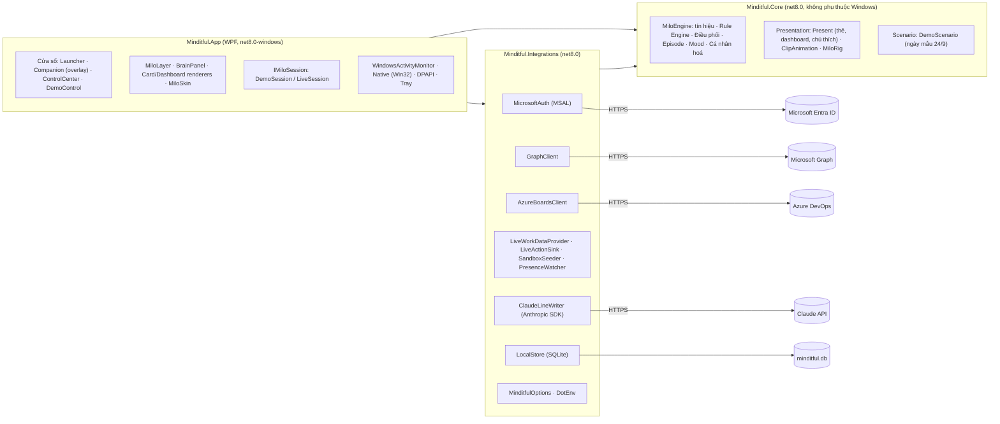

| Project | Chứa gì | Vì sao tách |
| --- | --- | --- |
| **Minditful.Core** | Toàn bộ "bộ não": luật, hàng đợi, điều phối, episode, mood, cá nhân hoá, nội dung thẻ, keyframes hoạt ảnh, ngày mẫu | Không phụ thuộc Windows, UI hay mạng → **test được trên mọi OS** (160 test), và 3 môi trường dùng chung đúng một bộ não |
| **Minditful.Integrations** | Nói chuyện với thế giới ngoài: Entra/MSAL, Graph, Azure DevOps, Claude, SQLite, cấu hình, `.env` | Tách I/O khỏi logic; đổi nhà cung cấp mà không đụng bộ não |
| **Minditful.App** | WPF: cửa sổ, overlay, vẽ Milo, khay hệ thống, tín hiệu Windows, vòng lặp thời gian của từng môi trường | Phần duy nhất cần Windows |

### 2.2 Nguyên tắc thiết kế

1. **Một bộ não, nhiều nguồn dữ liệu.** `MiloEngine` không biết mình đang chạy Demo hay Prod. Nó chỉ nhận *thời gian*, *tín hiệu* (khoá máy, gõ phím, đang họp…) và *ảnh chụp dữ liệu* (`WorkSnapshot`).
2. **Engine đồng bộ, thế giới bất đồng bộ.** Engine chạy theo từng giây mô phỏng, không bao giờ `await`. Mọi thứ cần gọi ra ngoài (tạo lịch, bật DND, hỏi Claude) được engine **phát sự kiện**, host xử lý bất đồng bộ rồi **trả kết quả lại** qua method (`SetLine`, `SetMoodInsight`…).
3. **Hạ cấp thay vì báo lỗi.** Thiếu quyền, mất mạng, không có API key → tắt đúng phần đó, phần còn lại chạy tiếp; không bật popup lỗi (§14).
4. **Riêng tư mặc định.** LLM chỉ nhận số liệu; dữ liệu local không có tiêu đề; tự xoá theo tuần.

---

## 3. Ba môi trường

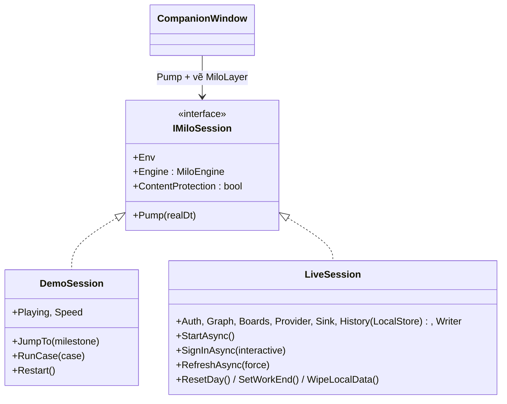

| | **Demo** (`--env Scenario`) | **Sandbox** (`--env Sandbox`) | **Production** (`--env Prod`) |
| --- | --- | --- | --- |
| Class | `DemoSession` | `LiveSession` | `LiveSession` |
| Giờ | Đồng hồ **kịch bản** ngày 24/9: tua 60/120/300× khi Milo ẩn, 1× khi Milo hiện | Giờ thật | Giờ thật |
| Dữ liệu | `DemoScenario.Snapshot()` cố định | Graph + Azure Boards của tenant `mindiful.onmicrosoft.com` | Graph + Azure Boards của Bosch |
| Tín hiệu (khoá máy, gõ…) | Kịch bản (`ScenarioScript.World`) + công tắc "Giả vờ bạn đang…" | Windows thật (+ công tắc giả lập đè lên, chỉ ở chế độ test) | Windows thật |
| Presence Teams | Theo lịch kịch bản | `/me/presence` | `/me/presence` |
| Người dùng mẫu tự bấm | Có (`AutoReplies`), tắt được | Không | Không |
| Ngưỡng hành vi | Chuẩn (§4, §8) | Chế độ test: **rút gọn** (`BehaviorOverrides`) để test trong 1 buổi · Như Production: chuẩn. Đổi lúc chạy bằng `LiveSession.SetTestMode` → `BehaviorProfile.Apply` | Chuẩn |
| Lưu SQLite | Không | Có | Có |
| Hành động ra ngoài | Chỉ ghi nhật ký | Gọi API thật | Gọi API thật (hạ cấp khi thiếu quyền) |
| Ẩn khi share màn hình | Không | Có | Có |
| Bảng điều khiển | `DemoControlWindow` | `ControlCenterWindow`; trang Thử tình huống chỉ hiện ở chế độ test | `ControlCenterWindow` |

Giao diện Milo trên desktop (`CompanionWindow` + `MiloLayer`) **giống hệt nhau** ở cả 3 môi trường.

---

## 4. Vòng đời app

### 4.1 Khởi động

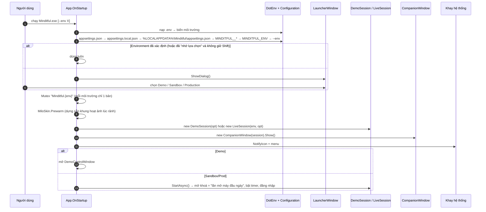

Thứ tự ưu tiên cấu hình (sau đè trước): `appsettings.json` < `appsettings.local.json` < `%LOCALAPPDATA%\Minditful\appsettings.json` < biến `MINDITFUL__…` (kể cả từ `.env`) < `MINDITFUL_ENV` < `--env`. Biến môi trường thật của máy luôn thắng `.env`.

### 4.2 Các vòng lặp đang chạy

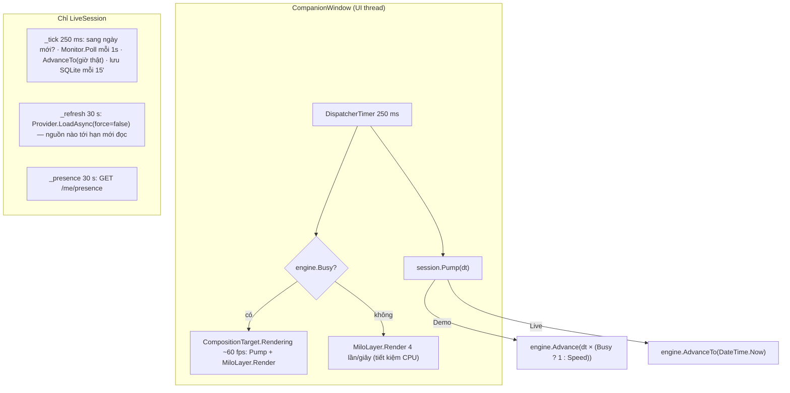

`Busy` = đang có episode, đang ghé ngang hoặc đang ló đầu. Nhờ vậy khi Milo ẩn app gần như không tốn CPU, còn khi Milo hiện thì hoạt ảnh mượt.

### 4.3 Sang ngày mới, tắt app

- **Sang ngày mới** (LiveSession thấy `DateTime.Now.Date` đổi): nếu hôm trước chưa "Về thôi" thì lưu bản ghi ngày im lặng (§6.4 "tắt máy ngang") → `Engine.StartNewDay` → tính lại cá nhân hoá → **dọn dữ liệu cũ** (mục 9) → đọc lại dữ liệu.
- **Tắt app** (Thoát ở khay): lưu ngày hiện tại vào SQLite, dừng timer, gỡ hook Windows, xoá file đính kèm tạm.

---

## 5. Bộ não (Minditful.Core)

### 5.1 Thời gian mô phỏng

Engine dùng một con số duy nhất `S.T` = **số giây tính từ 00:00** của ngày đang chạy. `Advance(sec)` tăng `S.T` từng bước tối đa 1 giây và gọi `Tick()` mỗi bước:

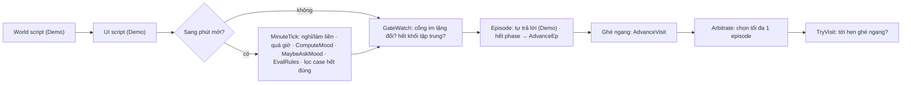

Luật (EvalRules) chạy **mỗi phút**; điều phối (Arbitrate) chạy **mỗi giây** để phản ứng nhanh khi cổng mở. Demo nhảy mốc bằng `RunTo(t)`: chạy lại từ 08:50 ở chế độ `Instant` (hoạt ảnh = 0 giây, không phát hành động ra ngoài) — nên kết quả luôn giống nhau (random có seed cố định `mulberry32(24)` như prototype).

### 5.2 Tín hiệu

| Tín hiệu | Engine API | Demo lấy từ | Live lấy từ |
| --- | --- | --- | --- |
| Khoá / mở máy | `SetLocked` | Kịch bản 08:58, 12:15, 12:55, 18:32 | `SystemEvents.SessionSwitch`, `PowerModeChanged` |
| Rời máy | `SetAway` | Kịch bản 10:30–10:37 | Idle ≥ `AwayAfterMinutes` (5') qua `GetLastInputInfo`; 5 phút idle được tính luôn vào lần nghỉ |
| Đang gõ | `SetTyping` | Công tắc "Giả vờ bạn đang…" | Idle < 3s liên tục ≥ 20s |
| Toàn màn hình | `SetFullscreen` | Nút | `SHQueryUserNotificationState` = busy/D3D/presentation, hoặc cửa sổ foreground phủ kín màn hình |
| Chuyển app | `RecordSwitch` | Nút "Nhảy việc 12 lần" | `SetWinEventHook(EVENT_SYSTEM_FOREGROUND)`, bỏ tiến trình shell, chống đếm trùng 2s |
| Đang họp | `SetInCallOverride` | Theo lịch (`Ongoing()`) | Presence `InACall/InAConferenceCall/InAMeeting/Presenting`; `Offline`/lỗi → `null` = đoán theo lịch |
| Không làm phiền | `SetUserDnd` | Nút | Presence `DoNotDisturb/UrgentInterruptionsOnly` — trừ khi chính Milo bật (`Sink.OwnsDnd`) |
| Task xong | `MarkTaskDone` / `ApplySnapshot` | Kịch bản 17:45 | WIQL "Done hôm nay"; lần đọc đầu chỉ ghi nhận, không ăn mừng |

Tín hiệu **tổng hợp** mà engine tự tính: chuỗi làm liền (`Streak`), tổng nghỉ, đã nghỉ trưa (nghỉ ≥ 20' trong 11:00–14:00), chuỗi họp (`Chains`: cách nhau < 5'), phút họp, phút quá giờ, chuyển việc/giờ, task kẹt, email chờ.

### 5.3 Trạng thái hiện diện (§3)

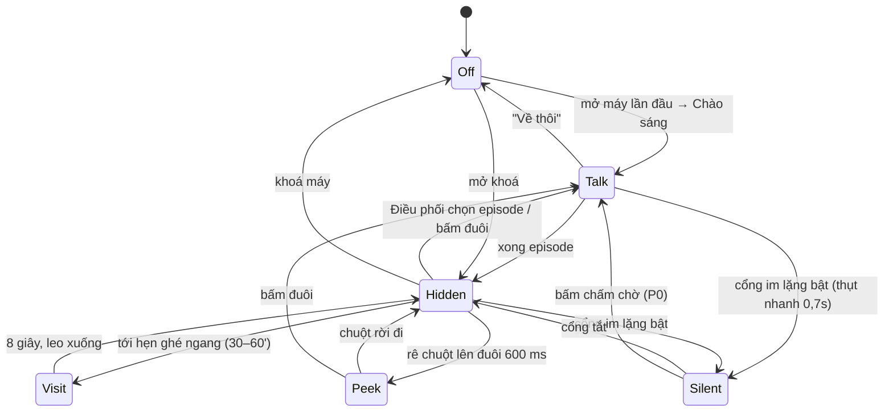

`Presence()` trả về: `Talk` nếu có episode → `Off` nếu cổng Nghỉ làm/Khoá máy → `Silent` nếu cổng khác đóng → `Visit` → `Peek` → `Hidden`.

### 5.4 Cổng im lặng (§4)

`HardGate()` kiểm tra theo đúng thứ tự:

| # | Cổng | Điều kiện | Milo | Lời nhắc mới |
| --- | --- | --- | --- | --- |
| 1 | Nghỉ làm | Chưa mở máy lần đầu | Không hiện gì | Không xét |
| 2 | Khoá máy | Đang khoá | Không hiện gì | Vào hàng đợi, không chấm |
| 3 | Nghỉ làm | Đã "Về thôi" (còn thao tác 15' thì thức lại) | Không hiện gì | Chỉ Quá giờ |
| 4 | Đang họp | `InCall()` | Ẩn cả đuôi | Vào hàng đợi, **chấm chờ** |
| 5 | Toàn màn hình | Tín hiệu | Ẩn | Chấm chờ |
| 6 | Giờ tập trung | Khối do Milo khoá | Ẩn | Chấm chờ |
| 7 | Không làm phiền | Người dùng tự bật | Ẩn | Chấm chờ |

Khi cổng **Đang họp** tắt: chờ 2 phút ổn định (`Settle`), trong 10 phút sau đó Milo vào bằng **JumpIn** (nhảy vòng cung). Nếu episode đang hiện mà cổng bật → thụt nhanh, episode quay lại hàng đợi (trừ Sắp họp/Dashboard bị bỏ).

### 5.5 Rule Engine — 16 case

`EvalRules()` chạy mỗi phút, mỗi case đủ điều kiện được `Enqueue` (1 chỗ/case, luôn mang số liệu mới nhất). Case có điều kiện mà **không còn đúng** thì bị xoá khỏi hàng đợi.

| Case (`CaseId`) | Nhóm | P | Điều kiện (ngưỡng chuẩn; Sandbox rút gọn) | Giới hạn | Chờ trả lời |
| --- | --- | --- | --- | --- | --- |
| Chào sáng `MorningHello` | Xã giao | 1 | Mở máy lần đầu trong ngày (Live: trước 12:00) | 1/ngày | 20s |
| Sắp họp `MeetingSoon` | Hỗ trợ | 1 | Còn ≤ 5' tới sự kiện online, không đang trong call khác; hết hạn khi họp bắt đầu | 1/cuộc | 60s |
| Tan tầm `EodWrapup` | Xã giao | 2 | Tới giờ kết thúc khung làm việc | 1/ngày | 60s |
| Họp liên tục `MeetingOverload` | Chăm sóc | 2 | Chuỗi ≥ 3 cuộc vừa xong trong 60'; hoặc tới khối "Nghỉ" đã giữ | 3/ngày | 45s |
| Nghỉ quá ít `LowRest` | Chăm sóc | 2 | Làm ≥ 3h, tổng nghỉ < 50% × 45' × giờ làm/8 | 2/ngày | 45s |
| Quá giờ `Overtime` | Chăm sóc | 3→2 | Còn thao tác > 30' sau giờ về (mỗi 30' tăng 1 mức) | 4/ngày | 45s |
| Làm liền `NoBreak` | Chăm sóc | 3 | Không nghỉ ≥ 5' trong ≥ 120' (Sandbox 20') | 3/ngày | 45s |
| Chưa nghỉ trưa `LunchMissed` | Chăm sóc | 3 | 12:30–14:00, chưa có lần nghỉ ≥ 20' | 2/ngày | 45s |
| Phân mảnh `HighFragmentation` | Chăm sóc | 3 | > N lần chuyển app/giờ (spec 8, Live mặc định 30) | 2/ngày | 45s |
| Nhắc lại tan tầm `EodNudge` | Xã giao | 3 | 30' sau "Thêm 30 phút" | 1/ngày | 30s |
| Lịch kín `CalendarPacked` | Hỗ trợ | 4 | ≥ 3 cuộc liền nhau trong 4h tới, cùng buổi | 1/buổi | 45s |
| Task kẹt `StuckTask` | Hỗ trợ | 4 | Work item Active ≥ 3 ngày làm việc (Sandbox 0), lịch trống ≥ 45' | 1/ngày | 45s |
| Email chờ `EmailWaiting` | Hỗ trợ | 4 | Có email hỏi thẳng bạn chờ ≥ 1 ngày, sau 10:00 (Sandbox 00:00) | 1/buổi | 45s |
| Task xong `TaskDone` | Hỗ trợ | 5 | Work item chuyển Done | không | bóng thoại 3s |
| Hết giờ tập trung `FocusDone` | Hỗ trợ | 1 | Khối tập trung kết thúc | không | bóng thoại 3s |
| Chào hỏi `CheckIn` | Xã giao | 5 | Ngẫu nhiên 2%/phút trong 10:00–16:30, điểm ≥ 60, ≥ 2h từ lần nói trước | 2/ngày | 15s |
| Dashboard `Dashboard` | Người dùng | 0 | Bấm chóp đuôi / Milo | — | không hết giờ |

### 5.6 Điều phối — chọn tối đa 1 episode

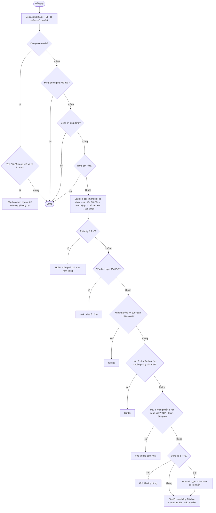

Khi giao một **case chăm sóc**, các case chăm sóc khác đang chờ bị **gộp vào tổng kết cuối ngày** (§8b) — chỉ nhắc 1 case chăm sóc/lần.

### 5.7 Vòng đời một episode

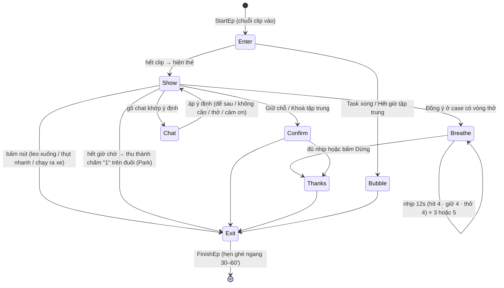

Mỗi phase có `PhaseEnd`; `Tick` gọi `AdvanceEp()` khi tới hạn. `CardVer` tăng mỗi khi nội dung thẻ đổi → UI chỉ vẽ lại thẻ khi cần.

### 5.8 Phản hồi & chat (§10)

| Nút / hành động | Kết quả |
| --- | --- |
| Đồng ý (chăm sóc) | Hoạt động riêng của case (thở 3/5 nhịp, đi ăn, khoá tập trung 30', chạy ra xe) → +3 điểm (tối đa +12/ngày) |
| Để sau (Np) | Nhắc lại sau N phút nếu còn đúng; tối đa 2 lần/ngày, lần 3 mất nút |
| Không cần | Ẩn case 60–90'; lần 2 trong ngày → mọi thời gian chờ ×3 |
| Không trả lời | Thẻ thu vào, chấm "1" trên đuôi 30' (bấm đuôi để mở lại) |
| Chat | Nhận diện từ khoá local: *bận* → Để sau · *mệt* → vòng thở · *thôi/không* → Không cần · *cảm ơn* → +1. Không khớp → hỏi Claude (nếu bật) hoặc câu mặc định |

### 5.9 Mood Engine (§11) và 2 hướng tính

```
điểm luật = clamp(92 − Σ phạt + Σ thưởng, 0, 100)      // MoodModel.Score(MoodInputs)
```

Công thức nằm riêng trong `MoodModel` (hàm thuần, nhận `MoodInputs`) để kiểm chứng độc lập với engine. Căn cứ nghiên cứu từng khoản, cách chứng minh bằng property-based test (`MoodEvidenceTests`) và cách kiểm chứng với người thật bằng WHO-5: [CO-SO-KHOA-HOC.md](CO-SO-KHOA-HOC.md). Khoản mới **quá giờ cả tuần**: 0,05 × phút quá giờ vượt 8 giờ/tuần (> 48 giờ/tuần), tối đa 10.

| Phạt | Công thức | Tối đa |
| --- | --- | --- |
| Họp | 0,1 × phút họp vượt 180 | 20 |
| Chuỗi họp | 4 × số cuộc vượt 2 trong chuỗi dài nhất | 12 |
| Làm liền | 0,2 × phút vượt 90 của chuỗi hiện tại | 15 |
| Quá giờ | 0,33 × phút quá giờ (+5 nếu bắt đầu sớm hơn khung 30') | 25+5 |
| Thiếu nghỉ | 0,5 × (45 × giờ làm/8 − phút nghỉ), sau 2h làm | 15 |
| Phân mảnh | 2 × lần chuyển việc vượt ngưỡng/giờ | 12 |
| Workload | task đang làm / trung bình > 1,5 → 6; > 2 → 10 | 10 |
| Task kẹt / Email chờ | 2/task kẹt · 1/email vượt 2 | 6 / 4 |

Thưởng: +3 mỗi lần đồng ý nghỉ (≤12), +2 mỗi task xong (≤6), +4 mỗi khối tập trung (≤8).

**Mức** (có trễ 3 điểm để không nhảy qua lại): ≥80 *Mọng* · 60–79 *Cân bằng* · 40–59 *Mệt dần* (bão hoà 0,75) · <40 *Kiệt sức* (0,55 + chữ z).

| `Llm.Features.Mood` | Điểm hiển thị | Office Vibe |
| --- | --- | --- |
| `Rules` (mặc định) | Điểm luật | Theo công thức §11 |
| `Hybrid` | Điểm luật + `adjust` của Claude (chặn ±10) | Claude đặt lại Tập trung/Năng lượng/Căng thẳng |
| `Llm` | `score` của Claude; quá 2 chu kỳ không có nhận xét mới → điểm luật | Claude |

Claude được hỏi mỗi `MoodIntervalMinutes` (30') qua sự kiện `MoodWanted`.

### 5.10 Đánh giá cuộc họp

Mỗi khi có cuộc họp mới (lúc khởi tạo, `ApplySnapshot`, sang ngày), `AssessMeetings()` luôn tạo **đánh giá theo luật** (`MeetingRules.Assess`): mức nặng 1–5 từ độ dài (≤30' → 1 … >90' → 4) +1 nếu ≥ 6 người, +1 nếu trình bày, +1 nếu là cuộc thứ 3+ trong chuỗi, +1 nếu ngoài giờ/đè trưa; loại họp; số phút nên nghỉ sau. Nếu `Features.Meetings = Llm` thì phát `MeetingWanted` để Claude đánh giá lại, kết quả thay thế bản luật.

### 5.11 Cá nhân hoá (§14)

- **Luật 1 (trong ngày):** "Không cần" lần 2 → thời gian chờ ×3.
- **Luật 2 (7 ngày):** case hiện ≥ 5 lần, ≥ 60% bị Không cần/bỏ qua → chờ ×2, ngưỡng kích hoạt +15%.
- **Luật 3 (7 ngày):** case bị Để sau ≥ 60% → giao ở khoảng trống dài nhất kế tiếp (`LongestGapLater`).

`Personalizer.Compute(outcomes 7 ngày)` chạy mỗi đầu ngày → `Engine.Tuning`.

---

### 5.12 Tính năng mở rộng (mục `Wellbeing`)

Thêm sau prototype, cùng khung Rule Engine → hàng đợi → điều phối, nên vẫn chịu cổng im lặng và ngân sách như 16 case gốc. 3 case mới đứng cuối enum `CaseId` để không đổi thứ tự phá hoà của case gốc.

| Case / cơ chế | Loại | Điều kiện (`EvalRules`) | Kết quả |
| --- | --- | --- | --- |
| `FocusPlan` · Giữ giờ tập trung | Hỗ trợ, P4, cần 5' trống | `Cfg.FocusPlan`, ≥ 20' sau lần mở máy đầu, trước 15:00, chưa có khối tập trung, `FocusSlot()` tìm được ≥ 60' | *Giữ* → `Hold("focusPlan")` + `MiloAction.HoldFocus` (busy). `StartHeldFocus()` mỗi phút: tới giờ, đang ngồi máy, không họp → bật tập trung, `StartFocus(CalendarHeld: true)` |
| `WeekReport` · Báo cáo tuần | Xã giao, P4 | `Cfg.WeekReport`, thứ Hai, `Snap.LastWeek` có dữ liệu, sau Chào sáng | Thẻ tổng kết + `Present.WeekTip()`. *Xem chùm nho* đổi thẳng episode sang Dashboard trang Tuần |
| `MicroBreak` · Nghỉ ngắn (uống nước, vươn vai) | Hỗ trợ, P5, miễn ngân sách | `Cfg.MicroBreakEveryMin > 0`, `NmRun` (phút ngồi máy liên tục, không họp) ≥ N, cách lần trước ≥ N, chưa quá số lần/ngày | Bóng thoại 5 giây như Task xong, không nút |
| `Gate.Presenting` | Cổng | `SetPresenting(true)` từ Teams presence "Presenting" | Như các cổng khác, nhưng `Presence()` = Off nên ẩn cả chóp đuôi và chấm chờ |
| "Hôm nay thấy sao?" | Nút trên thẻ Tan tầm | `Cfg.EveningCheck` | `Reply("feel", good/ok/bad)` → `S.Feeling`; Mood Engine: Mệt −6, Vui +3; `DayRecord.Feeling`; gửi cho Claude trong `BuildMoodRequest` |
| Nghỉ ngày mai | Nút trên thẻ Tan tầm | `TomorrowChain()` ≥ 3 cuộc liền trong `Snap.TomorrowCalendar` | `HoldBreak(DayOffset: 1)` sau cuộc thứ 2 |
| Tủ đồ | App + SQLite | `LiveActionSink.RecordStreak` lúc `DayClosed` hoặc lúc qua ngày | `LocalStore.RecordDay` → món mới → `Snap.Wardrobe` → thẻ Chào sáng + `MiloSkin` chèn phụ kiện vào nhóm `head`/`torso` của SVG để đi theo cử động |

## 6. UI/UX

### 6.1 Các cửa sổ

| Cửa sổ | Khi nào | Đặc điểm |
| --- | --- | --- |
| **LauncherWindow** | Chưa chọn môi trường | 3 thẻ, trạng thái cấu hình từng môi trường, "Nhớ lựa chọn" |
| **CompanionWindow** | Luôn có (3 môi trường) | 480×620, **trong suốt hoàn toàn**, Topmost, không có trong Alt+Tab (`WS_EX_TOOLWINDOW`), không chiếm focus; neo góc màn hình đang chọn, ngay trên taskbar. Chỗ không có Milo thì chuột **đi xuyên** xuống desktop (pixel alpha = 0). Sandbox/Prod: `SetWindowDisplayAffinity(WDA_EXCLUDEFROMCAPTURE)` → **không lộ khi share màn hình** |
| **DemoControlWindow** | Demo | Khung `ControlShell`. Trang: *Kịch bản trình diễn* (`DemoTour.Steps`: 23 bước phủ đủ 19 case, tự chạy khi Milo xong việc), *Bắt đầu* (Mood realtime: `SetStressLevel`, `SimulateBreak`, `CallMilo(hold)`; phát/tạm dừng, tốc độ, công tắc tự trả lời, số liệu hôm nay, mẹo), *Ngày mẫu* (17 mốc, bấm để tua), *Thử tình huống* (19 case chia 4 nhóm + công tắc "Giả vờ bạn đang…"), *Milo của bạn* (tủ đồ, góc neo), *Bộ não Milo* |
| **ControlCenterWindow** | Sandbox/Prod | Khung `ControlShell`. Trang *Kiểm chứng điểm* (WHO-5 hằng tuần, tương quan Pearson với điểm Milo, xuất CSV ẩn danh; bảng SQLite `validation_week`). Trang: *Tổng quan* (3 thẻ kết nối chấm xanh/vàng/đỏ, Milo đang thấy gì), *Kết nối* (Microsoft, PAT, API key Claude), *Thử tình huống* (chỉ Sandbox: reset ngày, giờ về, dữ liệu mẫu, chạy case, giả lập tín hiệu), *Milo của bạn* (tủ đồ, góc neo, tính năng chăm sóc, cá nhân hoá, dữ liệu trên máy), *Bộ não Milo* |
| **`ControlShell`** (`Views/Panel`) | — | Khung chung tông sáng (`P`: kem #F7F0E6, thẻ #FFFDF9, cam #E8772E). Thanh bên + dải "Milo đang làm gì" bằng lời thường (`Describe()`), đồng hồ, điểm mood. Mỗi trang dựng 1 lần; số liệu cập nhật 400 ms/lần qua `Tick()` chỉ cho trang đang mở |
| **Nhận diện** (`Rendering/Brand.cs`, `Assets/Brand`) | Mọi cửa sổ + khay | Logo Milo đội mũ Bosch (`milo.ico` cho exe/cửa sổ/khay, `logo.png` cho giao diện); dải 3 màu Bosch đặc `Brand.Stripe()` (đỏ · xanh dương · xanh lá) trên đầu bảng điều khiển và màn hình chọn môi trường |
| **Khay hệ thống** | Luôn có | Icon chóp đuôi vẽ bằng code; menu theo môi trường |

### 6.2 Bố cục góc Milo (`MiloLayer`)

Giữ đúng toạ độ prototype (tính từ góc neo, đơn vị px; "đáy" = mép trên taskbar):

| Thành phần | Cách góc (ngang, dọc) | Kích thước | Ghi chú |
| --- | --- | --- | --- |
| Vùng Milo (cắt ngoài vùng) | 0, 0 | 420×340 | Milo 150×150 cách mép 40px; ẩn = tụt xuống 175px ra ngoài vùng |
| Chóp đuôi | 96, 0 | 46×40 | Quầng thở 5s, màu theo mood, chấm số/đếm ngược; **kéo để đổi góc** |
| Thì thầm | 150, 68 | — | Khi ló đầu |
| Thẻ | 26, 162 (bấm chấm chờ: 26, 16) | 280–310 rộng | Hiệu ứng pop 0,35s |
| Dashboard trái cây | 0, 0 (khung 340×360) | 4 bong bóng 84px (chùm nho tuần 100px) | Vòng cung bán kính 160 quanh đầu Milo; bung ra từ Milo, lần lượt 90 ms rồi nhấp nhô nhẹ; viền pastel theo quả; thanh tiêu đề nhỏ (Hôm nay/Tuần này · Chi tiết · ×) |
| Bảng chi tiết (`DetailDashboardView`) | 16, 150 | 290 rộng, cao tối đa 400 (cuộn mảnh) | Thay 4 quả khi bấm *Chi tiết* (`Episode.Detail`). Hôm nay: điểm + lời Milo, dòng thời gian giờ làm, Office Vibe, 3 cuộc họp sắp tới, chip số liệu. Tuần: 7 quả nho, thống kê, bạn trả lời Milo thế nào, bạn tự thấy, mẹo |
| Chấm chờ | 22, 10 | — | "N lời nhắc đang chờ" khi Im lặng |

Góc trái: lật ngang Milo và đổi neo sang trái. Góc trên: lật dọc (Milo thò xuống từ mép trên), mọi thứ neo theo mép trên.

### 6.3 Luồng tương tác chính

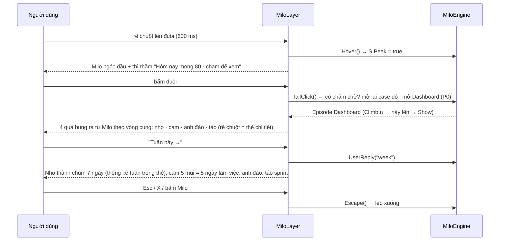

### 6.4 Nội dung thẻ

`Present.Card(engine)` trả về `CardModel` gồm các **khối** (`TopBlock` nhãn màu, `TitleBlock`, `ParagraphBlock`, `LineBlock` dòng email/task, `PeopleBlock` avatar + vai trò, `ScheduleBlock` lịch mini, `ProgressBlock` thanh sprint, `TilesBlock` 3 ô tổng kết, `ButtonsBlock`, `ChatBlock`…). `CardRenderer` (WPF) vẽ khối → giao diện; Core không biết WPF. Biến thể: `Card`, `Breathe` (vòng thở), `Say` (bóng thoại), `Chip` (nhãn gọn khi đang gõ).

**Câu chính** của thẻ lấy từ `Lines.Text`: câu Claude viết sẵn (nếu có) hoặc template (3–5 biến thể/case, xoay vòng). Nhãn, số liệu, nút **luôn** từ template.

### 6.5 Hoạt ảnh

Hai lớp chồng lên nhau:

1. **Toàn thân** — `ClipAnimation.Evaluate(clip, t)` trả về dịch/xoay/co giãn theo keyframes chép từ CSS prototype (leo lên, nhảy vòng cung, tụt, chạy ra xe…), có cubic-bezier.
2. **Từng bộ phận** — `MiloRig` sinh chuỗi khung (vd. leo 11 khung · 8 fps, chạy 9 · 10 fps): xoay `armL/armR`, `legL/legR`, `tail`, `head`, `earL/earR` quanh khớp, chớp mắt 4,5s/lần. `MiloSkin` chèn `transform` vào nhóm SVG tương ứng, dựng bằng SharpVectors, **cache** theo (tư thế, clip, khung, chớp mắt, độ bão hoà); dựng sẵn lúc máy rảnh.

Độ bão hoà theo mood được tính sẵn bằng ma trận `saturate()` của CSS (WPF không có hiệu ứng này).

---

## 7. Mô hình dữ liệu

### 7.1 Trong bộ nhớ (Core)

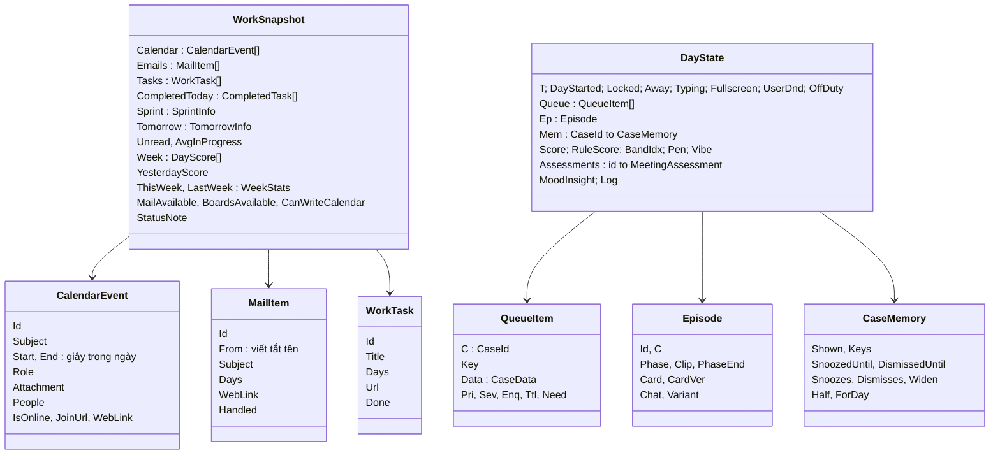

- `WorkSnapshot` là **ảnh chụp bất biến** dữ liệu ngoài; Live làm mới định kỳ bằng `ApplySnapshot` (giữ cờ email đã xử lý, task đã xong).
- `DayState` là **toàn bộ trạng thái 1 ngày** (tương ứng biến `S` của prototype); sang ngày mới thì tạo lại.
- `MiloAction` là **hành động ra ngoài**: `JoinMeeting`, `OpenAttachment`, `HoldBreak`, `StartFocus`, `EndFocus`, `OpenMail`, `DayClosed`.

### 7.2 Trên đĩa (SQLite `minditful.db`)

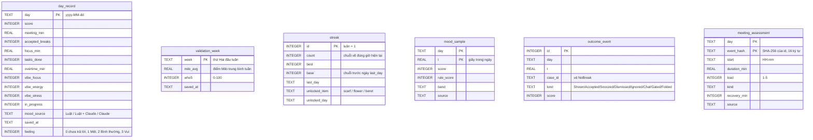

Không bảng nào có tiêu đề, nội dung, người tham dự hay id gốc của Outlook/Azure DevOps. Phiên bản schema lưu ở `PRAGMA user_version`.

| Ai đọc | Để làm gì |
| --- | --- |
| `Week()`, `Yesterday()` | Chùm nho 7 ngày, "Hôm qua 58" |
| `AvgInProgress()` | Baseline workload (cần ≥ 5 ngày) |
| `WeekStats()` | Thống kê tuần + so với tuần trước trong dashboard |
| `Outcomes(7 ngày)` | Cá nhân hoá luật 2–3 |
| `RecordDay()`, `Wardrobe()` | Tủ đồ: cập nhật chuỗi về đúng giờ lúc "Về thôi" hoặc lúc qua ngày; món mới báo ở thẻ Chào sáng hôm sau |

---

## 8. Tích hợp nền tảng

### 8.1 Microsoft Entra ID (đăng nhập)

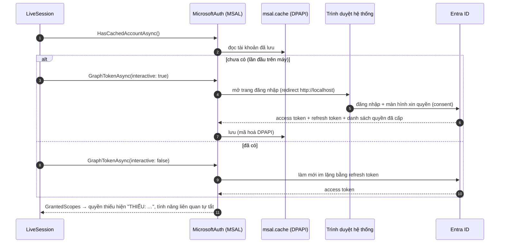

- Public client, single tenant (`TenantId` trong appsettings), không có client secret.
- Token Graph và token Azure DevOps (nếu `AzureDevOps.Auth = Entra`, scope `499b84ac-…/.default`) lấy riêng từ cùng tài khoản.
- `UseBroker: true` → dùng WAM (tài khoản Windows) thay trình duyệt; cần thêm redirect `ms-appx-web://microsoft.aad.brokerplugin/{clientId}`.
- Vòng nền **không bao giờ** tự bật trình duyệt; hết hạn thì chỉ báo "cần đăng nhập lại".

### 8.2 Microsoft Graph

Mọi request có header `Prefer: outlook.timezone="<giờ Windows>"` và tự thử lại tối đa 3 lần khi 429/5xx (theo `Retry-After`).

| Method · Endpoint | Quyền | Khi nào / tần suất | Dùng cho |
| --- | --- | --- | --- |
| `GET /me?$select=id,mail,userPrincipalName,displayName` | User.Read | Lần đầu | Biết "mình" trong danh sách người tham dự, id cho presence |
| `GET /me/calendarView` (hôm nay → mai) | Calendars.Read | 2 phút + khi mở khoá/đăng nhập | Lịch, chuỗi họp, vai trò, "mai 9:00 có Daily" |
| `GET /me/events/{id}/attachments?$select=name` | Calendars.Read | Khi cuộc họp bạn tổ chức có đính kèm (cache) | Nút "Mở slide" |
| `GET /me/events/{id}/attachments` | Calendars.Read | Bấm "Mở slide" | Tải file về `%TEMP%\Minditful` rồi mở |
| `POST /me/events` (category `Milo`) | Calendars.ReadWrite | Bấm Giữ chỗ / Khoá tập trung / Khoá trưa | "Nghỉ cùng Milo" (tentative), "Tập trung: #id" (busy) |
| `GET /me/mailFolders/inbox?$select=unreadItemCount` | Mail.Read | 5 phút | Bản tin sáng |
| `GET /me/mailFolders/inbox/messages` (10 ngày) | Mail.Read | 5 phút | Email chờ: bạn ở ô To, có "?" hoặc cờ, chưa trả lời |
| `GET /me/mailFolders/sentitems/messages` (10 ngày) | Mail.Read | 5 phút | Biết email nào đã trả lời (theo `conversationId`) |
| `GET /me/presence` | Presence.Read | 30 giây | Cổng Đang họp, Không làm phiền |
| `POST /users/{id}/presence/setUserPreferredPresence` | Presence.ReadWrite | Bắt đầu khối tập trung | Teams DND tới hết khối |
| `POST /users/{id}/presence/clearUserPreferredPresence` | Presence.ReadWrite | Hết khối tập trung | Trả presence về tự động |
| `POST /me/sendMail` | Mail.Send (không bắt buộc) | Chỉ nút "Tạo dữ liệu mẫu" | Gửi email mẫu cho chính mình |

Lọc lịch: bỏ sự kiện huỷ, cả ngày, `showAs = free`, đã từ chối, và category `Milo` (khối Milo tự tạo).

### 8.3 Azure DevOps (Azure Boards)

Xác thực: PAT (header `Basic base64(":"+PAT)`) hoặc Entra (Bearer). PAT sai → Azure DevOps trả 203 + trang HTML → app báo "PAT không hợp lệ".

| Method · Endpoint | Tần suất | Dùng cho |
| --- | --- | --- |
| `POST {org}/{project}/_apis/wit/wiql` — Assigned to @Me, State ∈ ActiveStates | 3 phút | Task đang làm, task kẹt (ngày làm việc từ `ActivatedDate`) |
| `POST …/wiql` — State ∈ DoneStates, `StateChangeDate >= @Today` | 3 phút | Task xong → Milo nhảy tưng |
| `GET {org}/_apis/wit/workitems?ids=…&errorPolicy=omit` | kèm 2 query trên | Tiêu đề, trạng thái, ngày, story point (không truyền danh sách field để tránh TF51535) |
| `GET {org}/{project}/{team}/_apis/work/teamsettings/iterations?$timeframe=current` | 3 phút | Sprint hiện tại, ngày còn lại |
| `GET …/iterations/{id}/workitems` | 3 phút | Tiến độ sprint (điểm hoặc số item) |
| `GET {org}/_apis/connectionData` · `POST …/workitems/$Task?bypassRules=true` | Chỉ "Tạo dữ liệu mẫu" | Tạo 6 task mẫu đã Active lùi ngày |

### 8.4 LLM (Lớp 2, tuỳ chọn)

`IMiloLlm` có 2 bản:
- `ClaudeLineWriter`: SDK Anthropic, structured output.
- `OpenAiCompatibleWriter`: HTTP `POST {BaseUrl}/chat/completions` với `response_format: json_object`, dùng cho Ollama, Groq, Gemini, OpenRouter.

Cả 2 dùng chung lời nhắc và cách đọc JSON. Chọn bằng `Llm.Provider`. `LlmBridge` đếm request và giãn nhịp chấm mood trong Demo (`DemoMoodMinSeconds`). Trang *Mood Engine* đổi `Cfg.MoodMode` / `MeetingMode` lúc chạy (`LlmBridge.SetModes`) và chạy `MoodEvaluation` (3 bộ kiểm chứng).

#### Claude API

Qua **Anthropic C# SDK** (`client.Beta.Messages.Create`), model mặc định `claude-opus-5`, `effort: low`, không retry, header beta `server-side-fallback-2026-07-01` + `fallbacks: "default"` (khi model từ chối thì server tự chuyển model).

| Loại | Kích hoạt | Gửi đi | Nhận về | Timeout | Lỗi/hết giờ → |
| --- | --- | --- | --- | --- | --- |
| Câu thoại | Case vào hàng đợi (`LineWanted`) | Tên case, số liệu, nút chính, câu mẫu | 1 câu ≤ 25 từ (kiểm tra `Lines.Clean`) | 2,5s | Template |
| Chat | Chat không khớp từ khoá (`ChatWanted`) | Tên case, số liệu, **câu người dùng gõ** | 1–2 câu | 2,5s | Câu mặc định |
| Mood | Mỗi 30' (`MoodWanted`) | Số liệu cả ngày (+ câu chat nếu bật) | JSON: score, adjust, focus, energy, stress, label, insight | 20s | Điểm luật |
| Cuộc họp | Cuộc họp mới (`MeetingWanted`) | Độ dài, giờ, số người, vai trò, vị trí trong chuỗi, trống sau đó | JSON: load, kind, recovery_min, note | 20s | Đánh giá luật |

Mood và cuộc họp dùng **structured output** (`output_config.format = json_schema`). API key đọc từ DPAPI (`claude-api-key.bin`) hoặc `ANTHROPIC_API_KEY`.

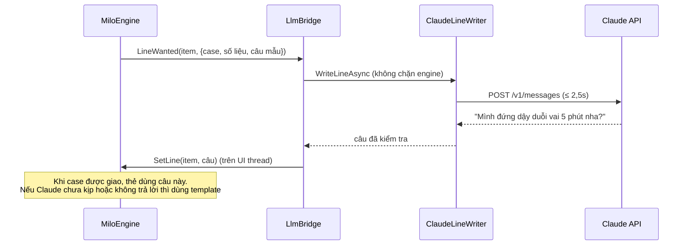

### 8.5 Windows

| API | Dùng cho |
| --- | --- |
| `SystemEvents.SessionSwitch` / `PowerModeChanged` | Khoá/mở khoá, ngủ/thức |
| `GetLastInputInfo` | Idle → rời máy, đang gõ |
| `SHQueryUserNotificationState`, `GetForegroundWindow`, `GetWindowRect`, `MonitorFromWindow` | Toàn màn hình |
| `SetWinEventHook(EVENT_SYSTEM_FOREGROUND)` | Đếm chuyển app (chỉ tên tiến trình, không đọc tiêu đề cửa sổ hay phím) |
| `SetWindowDisplayAffinity(WDA_EXCLUDEFROMCAPTURE)` | Ẩn Milo khi share màn hình |
| `SetWindowLongPtr(WS_EX_TOOLWINDOW)` | Không hiện trong Alt+Tab |
| `ProtectedData` (DPAPI, CurrentUser) | Mã hoá PAT, API key; MSAL cache |
| `System.Windows.Forms.NotifyIcon`, `Screen` | Khay hệ thống, vùng làm việc từng màn hình |
| `Process.Start(UseShellExecute)` | Mở link Teams, Outlook, file đính kèm |

### 8.6 Ví dụ trọn vẹn: "Task kẹt → Khoá 90 phút"

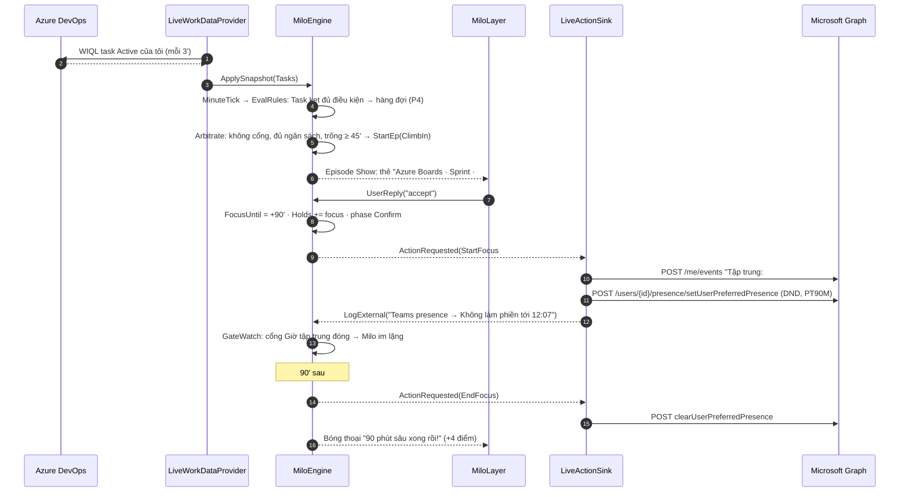

---

## 9. Lưu trữ & xoá dữ liệu

### 9.1 Mọi thứ app ghi xuống máy

Thư mục gốc: `%LOCALAPPDATA%\Minditful\` (mỗi môi trường một thư mục con `Demo`, `Sandbox`, `Production`).

| File | Nội dung | Bảo vệ | Xoá khi nào |
| --- | --- | --- | --- |
| `<Env>\minditful.db` (+ `-wal`, `-shm`) | Thống kê: mục 7.2 | Chỉ số liệu, id đã băm | **Tự xoá theo tuần/tháng** (9.2) · nút "Xoá toàn bộ dữ liệu thống kê ngay" |
| `<Env>\msal.cache` | Token Microsoft | DPAPI (MSAL) | Bảng điều khiển → Đăng xuất |
| `<Env>\ado-pat.bin` | PAT Azure DevOps | DPAPI (CurrentUser) | Nút "Xoá PAT" |
| `<Env>\claude-api-key.bin` | API key Claude | DPAPI | Lưu key rỗng / xoá file |
| `<Env>\corner.txt` | Góc neo của Milo | — | Không chứa dữ liệu cá nhân |
| `last-environment.txt` | Môi trường đã "nhớ" | — | Bỏ tick "Nhớ lựa chọn" |
| `crash.log` | Lỗi không lường trước | — | Xoá tay |
| `%TEMP%\Minditful\*` | File đính kèm vừa mở bằng "Mở slide" | — | **Xoá khi thoát app** |
| `.env` (repo hoặc thư mục gốc) | Cấu hình + bí mật do người dùng tự điền | Không commit (`.gitignore`) | Người dùng tự quản |

Demo không ghi thống kê (chỉ có `corner.txt`).

### 9.2 Tự xoá theo tuần / tháng

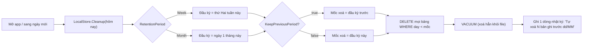

Ví dụ `Week` + `KeepPreviousPeriod = true` (mặc định): hôm nay thứ Năm 1/10 → giữ từ thứ Hai 21/9; thứ Hai 5/10 mở app → mọi thứ trước 28/9 biến mất. Luôn đủ 7 ngày gần nhất cho chùm nho và cá nhân hoá, nhưng không bao giờ giữ quá ~2 tuần.

### 9.3 Xoá sạch hoàn toàn

1. Bảng điều khiển → **Xoá toàn bộ dữ liệu thống kê ngay** (từng môi trường).
2. **Đăng xuất** Microsoft, **Xoá PAT**, xoá API key.
3. Thoát app, xoá thư mục `%LOCALAPPDATA%\Minditful`.
4. Trong Outlook, xoá các sự kiện category **Milo** (nếu muốn).

---

## 10. Riêng tư & bảo mật

| Dữ liệu | Rời khỏi máy? | Tới đâu |
| --- | --- | --- |
| Tiêu đề/nội dung email, cuộc họp, task | **Không** | Chỉ đọc từ Graph/Azure DevOps để hiển thị trên máy; không ghi xuống đĩa; không gửi Claude |
| Số liệu (phút họp, số task, điểm…) | Chỉ khi bật Claude | Claude API |
| Câu người dùng gõ cho Milo | Chỉ khi bật Claude chat (và `IncludeChatInMood` cho mood) | Claude API |
| Phím bấm, tiêu đề cửa sổ | **Không bao giờ đọc** | — (chỉ thời điểm có thao tác và tên tiến trình) |
| Sự kiện "Nghỉ cùng Milo", "Tập trung: #id", DND | Có (do người dùng bấm) | Outlook/Teams của chính người dùng |

Bí mật (token, PAT, API key) mã hoá DPAPI theo tài khoản Windows. Milo ẩn khi share màn hình (Sandbox/Prod). Không có server riêng: app nói chuyện trực tiếp với Microsoft, Azure DevOps và (tuỳ chọn) Anthropic.

---

## 11. Xử lý lỗi & hạ cấp

| Tình huống | App làm |
| --- | --- |
| Chưa đăng nhập / token hết hạn | Chạy tiếp với dữ liệu cũ; dashboard + Bảng điều khiển ghi "cần đăng nhập lại"; không bật trình duyệt giữa giờ |
| Thiếu `Calendars.ReadWrite` | Nút "Giữ chỗ trong lịch" → **"Nhắc tôi lúc đó"**, không có nút "Khoá 30' trong lịch" |
| Thiếu `Mail.Read` | Tắt Email chờ, bản tin sáng bỏ dòng email |
| Thiếu `Presence.ReadWrite` | Vẫn chặn lịch, nhắc người dùng tự bật DND |
| Presence `Offline`/lỗi | Cổng Đang họp đoán theo lịch; sau 10' ghi log "Teams chưa đăng nhập" |
| Chưa có PAT / PAT sai | "Chưa kết nối Azure Boards"; tắt Task kẹt/Task xong/workload/sprint |
| Graph 429/5xx | Chờ `Retry-After`, thử lại tối đa 3 lần |
| Không có API key Claude / Claude lỗi / quá giờ | Luật + câu mẫu; ghi lý do vào nhật ký |
| Lỗi không lường trước trên UI thread | Ghi `crash.log`, app chạy tiếp (Milo không được làm sập máy người dùng) |

Lỗi AADSTS được dịch sang tiếng Việt (admin consent, sai tenant, redirect URI, public client).

---

## 12. Cấu hình

`src/Minditful.App/appsettings.json` (mục `Minditful`), ghi đè bằng `.env` với tiền tố `MINDITFUL__Minditful__…` (`__` = `:`). Bảng đầy đủ tên biến `.env`, giá trị hợp lệ và công thức hay dùng nằm ở README mục *Tham chiếu biến `.env`*. `Wellbeing` chỉ áp dụng cho Sandbox/Production; Demo tắt sẵn (`EngineConfig` mặc định) để ngày mẫu giữ đúng mốc.

| Khoá | Mặc định | Ý nghĩa |
| --- | --- | --- |
| `Environment` / `MINDITFUL_ENV` / `--env` | trống | `Scenario`/`Demo`, `Sandbox`, `Prod`/`Production` |
| `WorkDay.Mode` | Flexible | Flexible: bắt đầu = lần mở máy đầu ngày trong `FlexEarliestStart`–`FlexLatestStart` (08:00–10:00), giờ về = bắt đầu + `FlexHours` (9). Giờ bắt đầu lưu trong bảng `day_start` nên mở lại app giữa ngày không bị tính lại. Fixed: dùng `Start/End` |
| `WorkDay.Start/End` | 09:00/18:00 | Khung cố định (Mode=Fixed) và ngày mẫu Demo |
| `WorkDay.AwayAfterMinutes` | 5 | Idle bao lâu thì là rời máy |
| `WorkDay.FragmentationPerHour` | 30 | Ngưỡng phân mảnh (Live) |
| `Storage.RetentionPeriod` | Week | Week / Month |
| `Storage.KeepPreviousPeriod` | true | Giữ thêm 1 kỳ trước |
| `Storage.MoodSampleMinutes` | 15 | Nhịp lưu mẫu mood |
| `Wellbeing.FocusPlan` / `FocusPlanMinMinutes` | true / 60 | Giữ giờ tập trung (§5.12) |
| `Wellbeing.WeekReport` | true | Báo cáo tuần sáng thứ Hai |
| `Wellbeing.MicroBreakEveryMinutes` / `MicroBreakMaxPerDay` | 50 / 6 | Nghỉ ngắn (0 = tắt) |
| `Wellbeing.EveningCheck` | true | "Hôm nay thấy sao?" + nghỉ giữa chuỗi họp ngày mai |
| `Wellbeing.HideWhenPresenting` | true | Cổng `Presenting` từ Teams presence |
| `Wellbeing.Wardrobe` | true | Tủ đồ |
| `Llm.Enabled` | true | Công tắc tổng Claude |
| `Llm.Model` / `Effort` | claude-opus-5 / low | |
| `Llm.Features.Lines/Chat` | true | Câu thoại / chat |
| `Llm.Features.Mood` | Rules | Rules / Hybrid / Llm |
| `Llm.Features.Meetings` | Rules | Rules / Llm |
| `<Env>.Graph.TenantId/ClientId/Scopes/UseBroker` | theo môi trường | Đăng nhập |
| `<Env>.AzureDevOps.Organization/Project/Team/Auth/PatEnvVar/ActiveStates/DoneStates` | theo môi trường | Azure Boards |
| `<Env>.PresenceMode` | Graph | Graph / Local |
| `<Env>.ContentProtection` | true | Ẩn khi share màn hình |
| `<Env>.Polling.*Seconds` | 30/120/300/180 | Presence / lịch / mail / Boards |
| `Sandbox.BehaviorOverrides.*` | xem appsettings | Ngưỡng rút gọn (chế độ test) |
| `Sandbox.TestMode` | true | Chế độ Sandbox lúc mở app lần đầu; lựa chọn trong bảng điều khiển lưu ở `%LOCALAPPDATA%\Minditful\Sandbox\test-mode.txt` và thắng giá trị này |

---

## 13. Kiểm thử

`dotnet test` chạy 160 test trên Core + Integrations (không cần Windows, không gọi mạng):

| File | Kiểm tra |
| --- | --- |
| `DemoDayTests` | Ngày mẫu ra đúng các mốc §13 (08:58 … 18:31, 54 điểm); im lặng suốt họp; nhảy mốc cho kết quả giống nhau |
| `AllCasesTests` | 16 case tự bật đúng luật; mọi nút của mọi thẻ; chấm chờ; chen ngang; cổng ngắt; chat |
| `PresentationTests` | Dựng mọi thẻ/dashboard ở mọi giây của ngày mẫu không lỗi |
| `LimitationsTests` | Câu thoại xoay vòng; LLM không nhận tiêu đề; khung clip; cá nhân hoá 7 ngày; ngưỡng Sandbox; hạ cấp quyền |
| `InsightTests` | Đánh giá cuộc họp luật/Claude; mood Hybrid ±10, Llm, hết hạn; công tắc cấu hình |
| `StorageTests` | SQLite: lưu, thống kê tuần, tự xoá tuần/tháng, không lưu tiêu đề, xoá toàn bộ, chuyển dữ liệu cũ |
| `DotEnvTests` | Đọc `.env`, biến thật được ưu tiên, `.env.sample` đủ khoá; mọi biến trong `.env.sample` và README đều có trong appsettings.json |
| `WorkHoursTests`, `ChatGoHomeTests` | Giờ làm linh hoạt 8→17 / 9→18 / 10→19; chat "về thôi", "đồng ý" ở thẻ tan tầm |
| `ExtendedFeaturesTests` | Giữ giờ tập trung (đề nghị, tới giờ bật DND), báo cáo tuần thứ Hai, nghỉ ngắn, trốn khi trình chiếu, "Hôm nay thấy sao?", nghỉ giữa chuỗi họp ngày mai, tủ đồ, bảng chi tiết dashboard |
| `MoodEvidenceTests` | Chứng minh công thức mood đúng chiều nghiên cứu với mọi dữ liệu: 20.000 bộ số ngẫu nhiên (JD-R: thêm áp lực không tăng điểm, thêm hồi phục không giảm điểm; nghỉ có lợi hơn khi việc nặng; > 48 giờ/tuần; nhảy việc) + lịch ngẫu nhiên chạy qua engine (họp cách 10' ≥ họp liền; thêm nghỉ không giảm điểm) |
| `ValidationTests` | WHO-5 (tổng × 4), tương quan Pearson, cặp số kiểm chứng giữ 12 tuần qua đợt tự xoá hằng tuần |
| `MoodEvaluationTests` | 3 bộ kiểm chứng (luật / AI / so sánh) chạy với AI giả: AI giống luật đạt hết; AI chấm lung tung, chấm ngược, hay lỗi đều bị bắt |
| `OpenAiCompatibleTests` | AI tương thích OpenAI với máy chủ giả: đúng định dạng Chat Completions, đọc JSON có ```json / số dạng chuỗi, gửi key dạng Bearer, báo lỗi 429, sai dạng thì về luật |
| `SilentAndDotTests` | Đang im lặng thì chóp đuôi mờ (trình chiếu thì ẩn hẳn); thẻ mở từ chấm chờ không kéo Milo ra đè lên thẻ |
| `DemoTourTests` | Kịch bản trình diễn phủ đủ mọi `CaseId`; chạy từng bước thì Milo giao đúng case; trình chiếu ẩn Milo; mood realtime giữ Milo đứng ngoài và đổi dáng ngay |
| `SandboxModeTests` | Chế độ test ↔ như Production: ngưỡng rút gọn / chuẩn đổi lúc đang chạy, không bật lại tính năng đã tắt |

Phần WPF và gọi API thật được kiểm bằng tay theo README mục "Hướng dẫn test 3 môi trường" và checklist ở KET-NOI-SANDBOX.md.

---

## 14. Mở rộng app

| Muốn | Sửa ở đâu |
| --- | --- |
| Thêm case mới | `CaseId` + `Catalog.Cases` (ưu tiên, màu, giới hạn) → luật trong `MiloEngine.Rules.EvalRules` → nút trong `MiloEngine.Episodes.Reply` → thẻ trong `Present.Card` → câu mẫu trong `Lines` → test trong `AllCasesTests` |
| Đổi ngưỡng | `EngineConfig` (chuẩn) hoặc `Sandbox.BehaviorOverrides` |
| Thêm nguồn dữ liệu (vd. Jira) | Client mới trong Integrations → đổ vào `WorkSnapshot` trong `LiveWorkDataProvider` |
| Thêm hành động ra ngoài | Thêm record vào `MiloAction` → xử lý trong `LiveActionSink` |
| Đổi LLM | `ClaudeLineWriter` là điểm duy nhất gọi LLM; engine chỉ biết `LineWanted/ChatWanted/MoodWanted/MeetingWanted` |
| Thêm tư thế/clip | SVG vào `Assets/Milo`, keyframes trong `ClipAnimation`, chuyển động bộ phận trong `MiloRig` |

---

## 15. Thuật ngữ

| Thuật ngữ | Nghĩa |
| --- | --- |
| **Case** | Một loại lời nhắc/episode (16 loại, `CaseId`) |
| **Episode** | Một lần Milo xuất hiện: Vào → Ở lại → Ra |
| **Clip** | Một đoạn hoạt ảnh (leo lên, vẫy, thở, chạy ra xe…) |
| **Cổng im lặng** | Điều kiện khiến Milo không được nói (họp, toàn màn hình, tập trung, DND, khoá máy, nghỉ làm) |
| **Chấm chờ** | Nhãn "N lời nhắc đang chờ" khi đang im lặng; bấm vào để mở ngay (P0) |
| **Chấm trên đuôi** | Lời nhắc không được trả lời, thu gọn 30' |
| **Ngân sách** | Giới hạn lời nhắc chủ động: cách nhau ≥ 15', ≤ 3/giờ, ≤ 10/ngày |
| **P0–P5** | Mức ưu tiên (P0 = người dùng tự mở, P1 = chào sáng/sắp họp…) |
| **Ghé ngang** | Milo ló lên 8 giây rồi đi, không nói gì, 30–60' một lần |
| **Mood / mức** | Điểm 0–100 và 4 mức Mọng / Cân bằng / Mệt dần / Kiệt sức |
| **Office Vibe** | 3 chỉ số 0–5: Tập trung, Năng lượng, Căng thẳng |
| **Chùm nho** | Biểu đồ 7 ngày trong dashboard, mỗi quả là điểm 1 ngày |
| **Snapshot** | Ảnh chụp dữ liệu lịch/email/task mà engine đọc |
| **Lớp 2** | Phần dùng LLM (Claude): câu thoại, chat, mood, cuộc họp |
| **Hạ cấp** | Thiếu quyền/dữ liệu thì tắt đúng tính năng đó, phần còn lại chạy tiếp |
